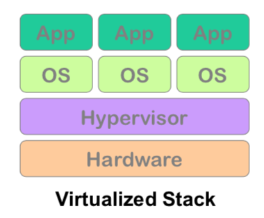
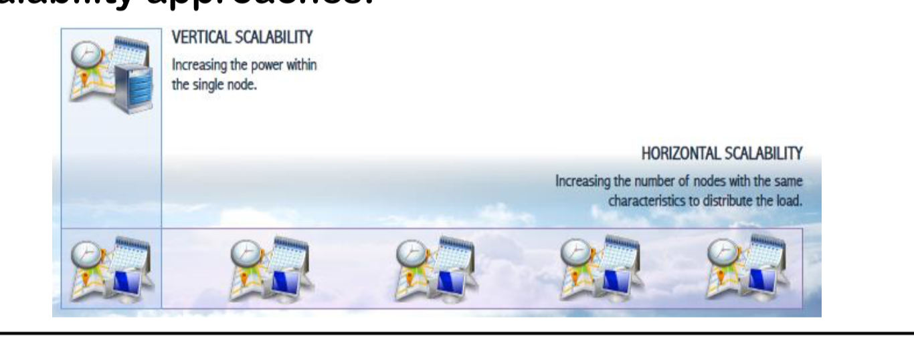
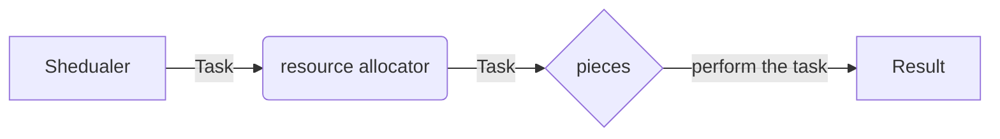
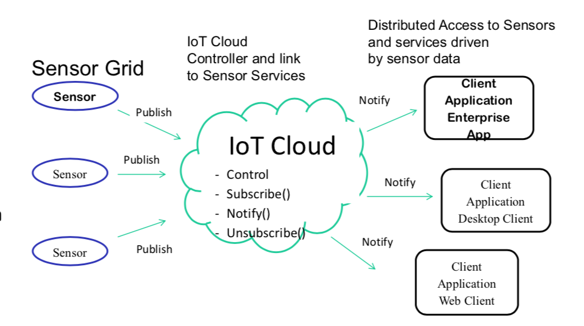
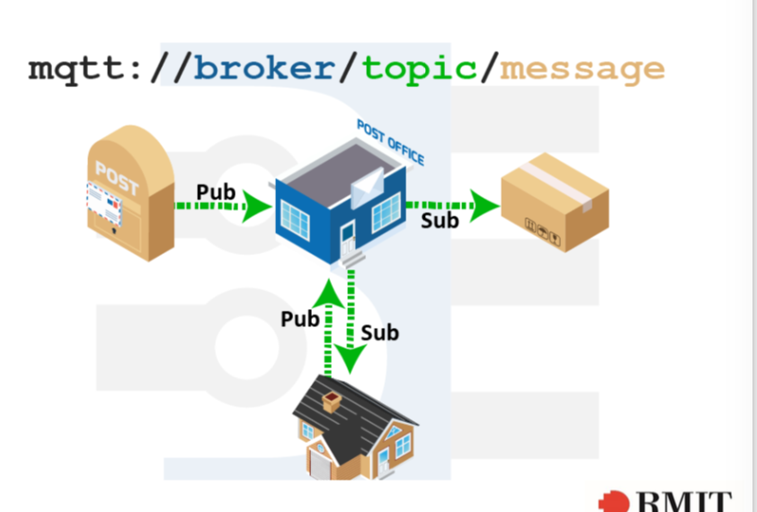

# Virtualization

 Use **Hypervisor** or virtualmachine.

**Hypervisor** manages multiple operating systems on a single computer system. Creates and run virtual machines



# Cloud characteristics

1. On demand self-service
   - Users are initiative
2. Board network access
   - Can be accessed via multiple devices
3. Resources pooling
   - Have multiple servers at multiple location
4. Rapid elascity
   - Auto Scaling
5. Measured service
   - Pay as you go

# Cloud service 3 models: SaaS, PaaS, IaaS

Infrastructure as a service > Platform as a service > Software as a service

IaaS: EC2

PaaS: Google app engine

SaaS: Gmail, Facebook


# 4 cloud deployment method

- Private cloud
  - Only for private business
- Community cliud
  - Shared between several business
- Public cloud
  - Available to the public
- Hybird cloud
  - Composition of 2 or more.

# Amazon services

**Compute service**

- EC2
- Automatic Scaling
- Elastic Balancing

**Networking service**

- Amazon VPC - private, isolated amazon cloud
- Amazon directconnect 
- Amazon Route 53 - dns domain system

**Storage service**

- Block Storage Service
- S3 bucket - REST，each bucket has their unique id.
- Glacier (for back up)
- Storage Gateway - integrates S3 and glacier

**Database Service**

- Relational database service
- dynamoDB
- Elastic Cache

**Big data service**

- Amazon elastic map reduce service (EMR) - hosted hadoop framework
- data pipeline - move data
- amazon redshift - contains petabyte-scale

**Application service**

- Amazon cloud front - distribute content globally
- Amazon cloud search - search service
- Amazon Elastic transcoder - for video

**Deployment and administration**

- amazon cloudWatch
- AWS Indentity and access management (IAM)
- AWS CloudFormation
- AWS OpsWorks
- AWS Elastic beanstalk


# Scalability

**Verticle Scalability**:

- Deploy the application on a more powerful hardware

**Horizontal scalability:**

- Deploying multiple instances of the same application and making them share the same internet address.

**Elastic Scalability**

- Ability to dynamic changes the resource allocation in demand.

**Load Balancing**

- optimize resource by distributing workloads across multiple computing resources: computers, computer cluster, ...



# Load Balancing

**Load Balancing**

- optimize resource by distributing workloads across multiple computing resources: computers, computer cluster, ...

**Amazon Elastic Load Balancing**

- distribute between multiple Amazon EC2 instances in the cloud.

# Type of computing

### Centralised Computing

- All computer resources are centralized in one physical system

### Parallel Computing

- Multiple **processes** run in parallel sharing the same memory.
- Use more than one computational engine ( not necessarily connected via a network )
- Share physical system most of the time.
- **Computational partitioning:**
  - Splits job or a program into smaller tasks.
  - the job, tasks can be performed at the same time.
  - different parts may process the same tasks or different tasks.
- **Data partitioning**
  - Splits the input data into smaller pieces.
  - Pieces will be processed on different workers
  - Pieces maybe processed by different parts or the same parts.
- **Mapping**

  - assigns tasks to run simultaneously on different workers.
  - handled by resource allocators in the system.
- **Synchronization**

  - is required since asynchronous in different workers may raise errors.
- **Communication**

  - is always triggered when the intermediate data is sent to workers.
- **Schedualing**

  - task scheduler assign tasks to different workers. 
  - resource allocator perform the actual mapping
  - schedualer only picks the next unassigned tasks based on scheduling policy
  - So



### Distributed computing

- Multiple autonomous computer, each has its own memory
- communicate through the same network
- each node task might be irrelevant to other nodes

**Advances of using parallel program on a distributed system**:

- Make the application run faster, response time
- Increase the resource utilization,

### Grid Computing

- Large number of distributed computing 
- Cross-organization, geography distributed

### Cluster computing

- Each computer has its own resources.
- Work together for a specific job
- **Each node of same node perform the same task**

### Ubiquitous computing

- wireless communication between the components
- perform computing across different devices
- also known as pervasive computing
  **Examples:** 
  - Smart traffic light
  - Home automation system
  - Fitbit
- Can combine with IOT

### Edge computing

- Local processing before going to the cloud
- So:
```graph
[sensors, controllers] => edge => cloud
```
-  Data from IoT devices analyzed at the edge before going to the cloud.
-  In edge computing, devices are collect and analyze IoT data themselves or transmit it to nearby computing devices (server, laptop, rpi)
**Example:** Driveless car, Intelligent Traffic System, Oil and gas monitoring

### Fog computing

- A small cloud before going to the actual cloud.
- So:
```graph
[sensors, controllers] => edge => fog => cloud
```
**Example:** 

  - Trains 
      - Trains move fast, difficult to install the cloud so implement fog computing nodes would be a good idea
 - Mining mining equipment
        - When working underground, the connection between the device and cloud it unstable, that's why installing some fog computing will be a good idea.

# p2p Systems

- Join and leaves freely
- No master-slaves
- No dedicated interconnection network

**Example:** BitTorrent, UTorrent, Skype


# Service-oriented architecture (SOA)

Multiple services are available to use for multiple applications.

**Example:** Catalog services, Map services, Globe services.

# Application programming interface (API)

API are published from database so other devices can communicate with database.

# Representational State Transfer (REST)

REST is a **software architecture style** for distributed system

It shows how should a client communicate with the server via HTTP, GET, POST, PUT, PATCH,  DELETE method.

**Example:** Amazon Simple Storage Service (S3)

# Publish-Subscribe model (Pub-Sub)

Subscriber will only receives the messages based on the categories they subscribed to without any knowledge of the publisher.

This is better than sending the message directly to specific receivers.

# Message Queuing

>  https://freetuts.net/synchronous-la-gi-asynchronous-la-gi-619.html
>
> **Asynchronous**:
>
> - Running the function parallel.
>
> **Synchronous:**
>
> - a function must be done to run another function

- This allows applications to communicate by sending messages to each other
- it's an asynchronous communication
- useful for distributed application.
# Elastic Cache

- Store, scale cache in the cloud.
- Improves the performance of a website.

**Examples:**

- Top 10 scores for a game.

# Content Distribution Network (CDN)

- Replication of the same web content around the globe using different web server clusters that replicated the origin server.

**Examples:**

- Netflix

# Cloud messaging/ Push notification

For sending notification data or information from servers toapplications. 

**Examples:** Mobile, Web notification, Google cloud messaging service, firebase cloud messaging, Amazon simple notification service. 

# Visualisation

**Google chart API (javascript)**

**Google Map API**

# Map reduce

Is a software framework which supports parallel and distributed computing on large data sets. 

**devides a task into small parts and assigns to different computers**

suitable when dealing with big data.

**Frameworks:**

- **Map** function:
  - Extracts information from raw data
- **Reduce** function:
  - Take the input of map function
  - Summarize the data output by the graph.

# Cloud DataBase

- Parallel and distributed Database
- RDBMS
- NoSQL
- DynamoDB
- MongoDB

```flow
s=>start: Input
o1=>operation: map function
o2=>operation: reduce function
e=>end: result
s->o1->o2->e
```

**Examples:** Google wordcount, Google pagerank, Facebook demographics.

# Hadoop

Framework for distributed processing or large datasets across large clusters of computer.

You need to write:

- Mapper
- Reduccer
- Driver
- Hadoop takes care of the rest.

**Core components**:

- Storage: HDFS
  - Hadoop distributed File System (HDFS)
  - Like NTFS or FAT.
  - `Hadoop. = MapReduce + HDFS`
- Process: Map/reduce

**Hadoop Master/slave architecture:**

```flow
s=>start: Job Tracker / NameNode
o=>operation: Task Tracker / DataNode
o1=>operation: Task Tracker / DataNode
s->o->o1
```

**Hadoop YARN:**

- Yet Another Resource Negotiator
- **A framework for job schedualing**

# Database sharding

Dividing into small database.

# Parallel Databases and Data Stores

Approach 1:

- memcache or other caching mechanisms to reduce database access

Approach 2:

- Using existing parallel database

Approach 3:

- Build parallel 

# No SQL:

- get (key)
- put (key,value) — create
- delete (key)
- Execute (key,operation,parameters) — invoke a function

# DynamoDB data model

**Partition key**

- Use partition key's value as input to internal hash function.

- The output from the hash function determines the partition where the item will be stored. 

  so like dictionary hash

**Partition key and Sort key**

- Primary key = partition key + sort key
- All item with **same partition key** will be sorted together.
- **Sorted order** determine by **sort key**
- It is ok to have same partition key but **short key must be different**

# Computing paradigms

- VMS
  - Machine as the unit of scale
  - Abstracts the hardware
  - **Example:** EC2
  - *If you want to configure macchines, storage, networking and OS*
- Containers
  - Application as the unit of scale
  - Abstracts the OS
  - **Example:** AWS Elastic containers, Docker.
  - *Run a server, configure applications, scaling*
- Serverless
  - Functions as the unit of scale
  - Abstracts the language runtime
  - **Example:** AWS Lambda
  - *Run your code when it's needed*

# Microservices

- AWS lambda + Amazon API gateway
- Evennt handles = one function per event type

# Software container

- A container to create multiple vitualisation OS environment using a shared system.
- Resources are dynamic based on the use.
- Example: Docker, Windows container, Google container.

# DataMining

- To analyse hidden data

  **Some techniques:**

  - classification

    - Classify items into group

  - Clustering

    - Divide dataset into different Cluster

  - Regression

    - Find the line of regression

  - Anomaly detection

    - Detect deviation from normal behavior

  - outlier detection

  - Pattern discovery,

  - Assocation rule discovery

    - find set of rule for items

**Type of data**

- Static
- Real-time

# Deep learning

- AWS Deep learning AMI
  - Tensorflow
  - Keras
  - Theano
- Google Cloud AI

# Internet of thing

- Can intergrate with ubiquitous computing and cloud
- Sensor grids
  - Webcams are sensor
  - Web page, Google Docs, Office 365 are sensor
  - Sensor being distributed are called sensor grids.
- **IOT sensor network**
  - Today's sensor networks are mostly wireless, are known as wireless sensor networks (WSNs)
  - a sensor network is composed of a large sensor nodes : temperature, motion, pressure, ...

# Sensor as a service

- Room sensor



# MQTT

is a machine - to machine or "Internet of thing " connectivity protocol on top of tcp/ip

allows extremely lightweight publish/subscribe messaging transport



In MQTT, there are:

- **broker** is the server, or post office
- and client.

Clients can publish (Pub) messages, other clients can subscribe (Sub) to topics or receive letters.

Clients can both pubish and subscribe.

# RFID

Radio Frequency Identification

**is to identify and track the object using radio waves**

Three types:

- Active RFID - containing a battery and transmitting signals autonomously
- passive RFID - no battery and require external source to provoke signal transmission
- battery-assisted passive RFID - require an external source to wake up but have higher forward link capacity

# Zigbee

- Zigbee is a high-level communication protocol using small, low-power, radio based sensor.
- Is simpler and less expensive than bluetooth or wifi

# Data Stream

- Unbounded data
  - infinite, continuous stream of data needs to be processed/ analyzed
- Push model
  - data production and procession is controlled by the source
- Concept of time
  - When data is produced and when processed data should be outputed

Why?

- Many application must process a large stream of live data

Requirement

- Scalable clusters,
- Simple programming model

# Person Identifiable Data(PID)

- The term applies to a combination of some of the following data items. Using things such as 

Name

Address

Postcode Telepone number, DOB, … to look. for the person.

#Code

### Amazon S3 create bucket JAVA

```java
String BUCKET = "bucket-id";
AmazonS3Client s3 = new AmazonS3Client(CREDENTIALS_PROVIDER,clientConfiguration);
```

```

### List bucket

​```java
s3.listBuckets();
```

### Create bucket

```java
if(!s3.doesBucketExist(BUCKET)){
    s3.createBucket(BUCKET);
}
```

### Map-reduce.

```pseudocode
map(String key, String value) {
    for each word w in value:
    	emit(w, "1");
}

reduce(String key, Iterator value) {
    int result = 0;
    for each v in values:
    	result += ParseInt(v);
    emit(key, result)
}
```

