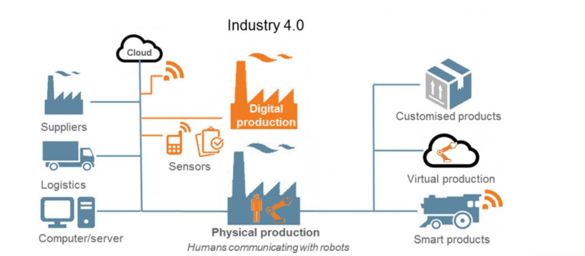
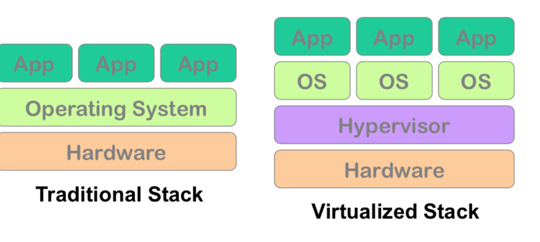
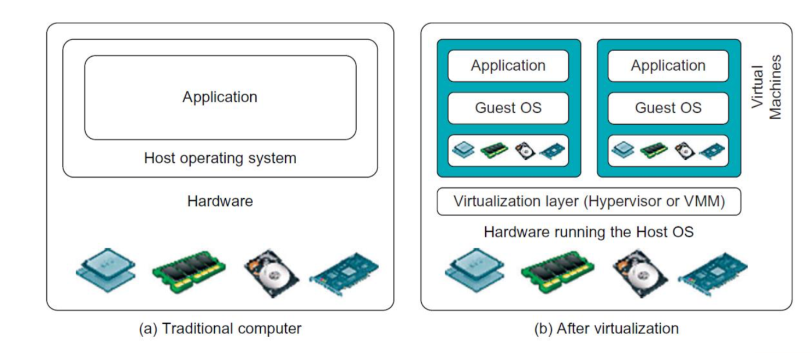
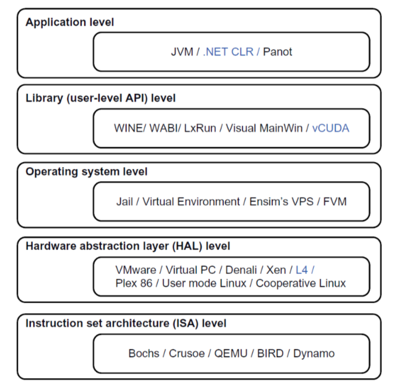
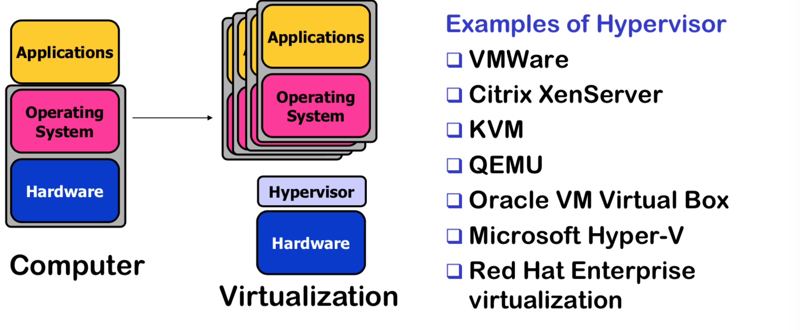
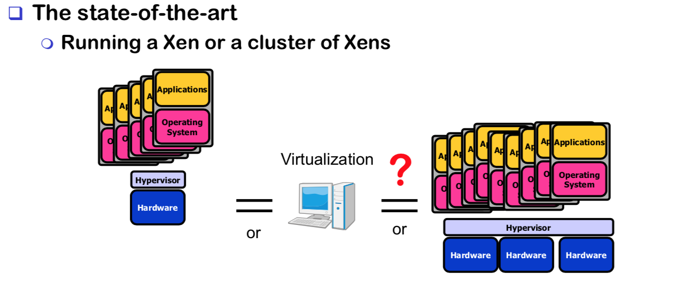
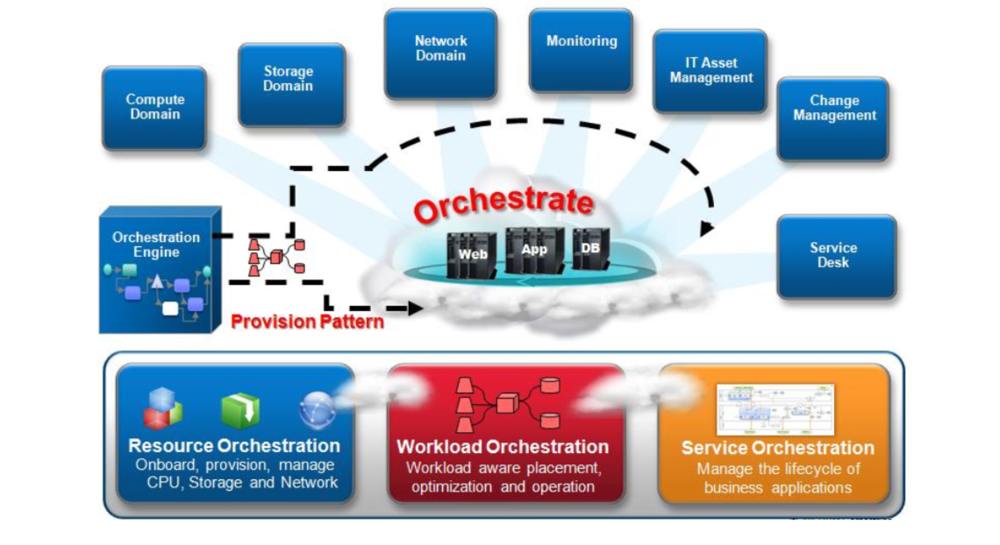
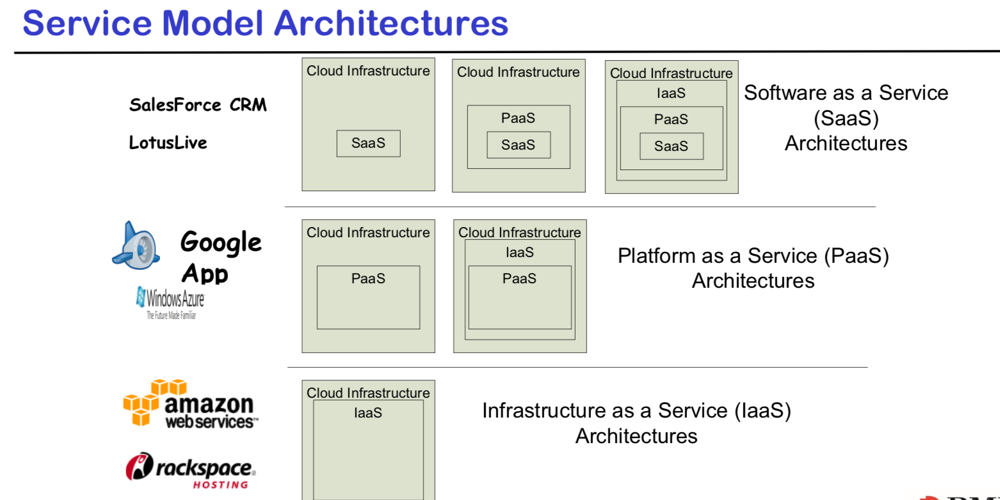
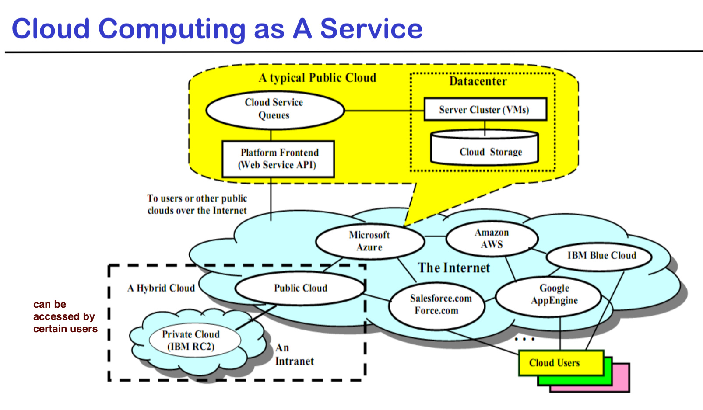

# Lecture 1: Introduction to cloud computing

### Cloud computing evolution

#### 1. Distributed computing
> Different cpu system
> Single adminstration

#### 2. Cluster Computing

> same performance computing system
>
> single system image

#### 3. Grid computing

> Like Distributed Computing but larger scale
>
> Cross-orginizational
>
> Server located in different area
>
> Distributed management

#### 4. Cloud computing

> Provide on demand, easier to access
>
> Based on virtual machine

### Cloud advantage

- Easier to access to application, shopping,gaming,… 
- Secure transfer between server and client
- Example: AI Self-Driving car, Smart city, transport system. Internet of things...

### Industry 4.0

> Capture information and analyse through cloud to get feedback.
>
> => Improve production.

### Big data

> **Definition**: The practice of using a network of remote servers hosted on the Internet to store, manage, and process data, rather than a local server or a personal computer. 
>
> Example: Google — because you're pushing many of your data to Google.	

### Large data centers issues

- Redundancy
- Efficency
- Utilization
- Management

### Virtualization

> **Hypervisor / Virtual Machine Monitor**: The software that creates and runs virtual machine.
>
> **Example:** Virtual box.
>
> It can manage multiple operating systems or the same operating system on a single computer.
>
> It also manage system's processor, memory and other resources.
>
> *It can be also called **Virtualization Manager** if designed for a particular processor architecture*

> **Hypervisor only sopports hardware-level virtualization**. However you can virualize different levels aswell.

**Virtualiation can be implemented on multiple machines.**

The more hardware the better

#### BENEFITS OF VIRTUALIZATION

- Consolidate under-utilized severs.
- Avoid downtime with VM relocation
- Dynamically re-balance workload to guarantee application
- Enforce security policy

*Capacity based on demand => Pay less*

### Cloud Orchestration

Managing and controlling cloud environements.

## 5 Essential cloud characteristics

### On-demand self-service

> Consumer can choose their own computing capabilities without requiring human interaction.

### Board network access

> Can be accessed via multiple devices: phones, tablets, laptops, computers.

### Resource pooling

> Resources are dynamically assigned and reassigned according to consumer demand.
>
> **Examples: ** AWS availability zones.

### Rapid Elasticity

> Capabilities can be elastic, dynamic.

### Measured Service

> Automatically control and optimize resource.
>
> Resource usage can be monitored, controlled.

## 3 Cloud service models

### Cloud Software as a Service (SaaS)

> Use provider's applications over a network
>
> **Example: Gmail, Facebook, Banking..**

### Cloud Platform as a Service (PaaS)

> Deploy customer-created applications to a cloud - API
>
> **Example: API, Google App Engine**

### Cloud Infrastructure as a Service (IaaS)

> Rent processing, storage, network capacity, and other fundamental computing resources
>
> **Example: Amazon's EC2, GoGrid, AppNexus*

## 4 Cloud deployment models

### Private Cloud:

> For single organization only. Maybe managed by a 3rd party
>
> **Example: RMIT cloud - only rmit users can use**

### Community Cloud

> Shared within several organizations. Managed by 3rd party.
>
> **Example: RMIT & Unimelb share product. So RMIT + Unimelb students can access**

### Public Cloud

> Available to the general public.
>
> **Example: Microsoft Azure, Google Cloud platform**

### Hybird cloud

> Composition of 2 or more clouds.
>
> **Example: Private Cloud + Public Cloud**

## Security Services

**Confidentiality**

> Who authorize to access information

**Availability**, **Integrity**

> Data should not be affected, lost, damanged

