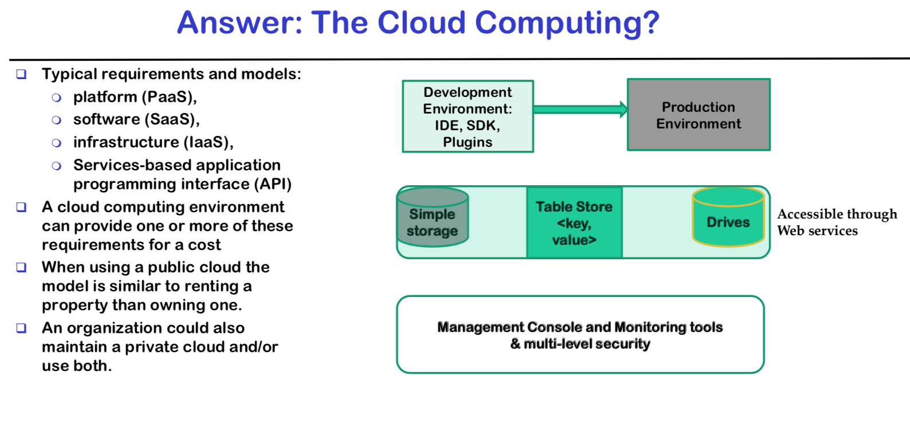
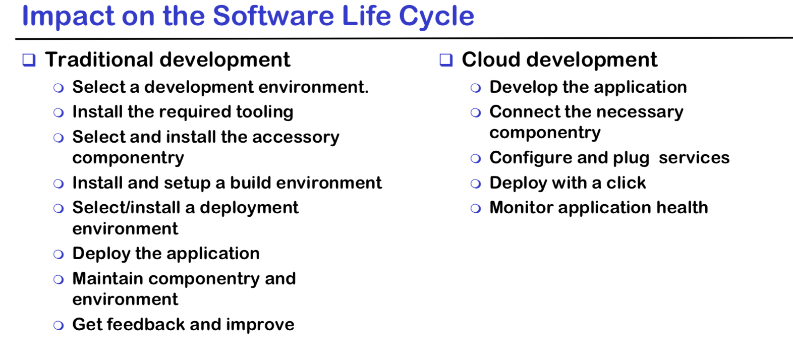
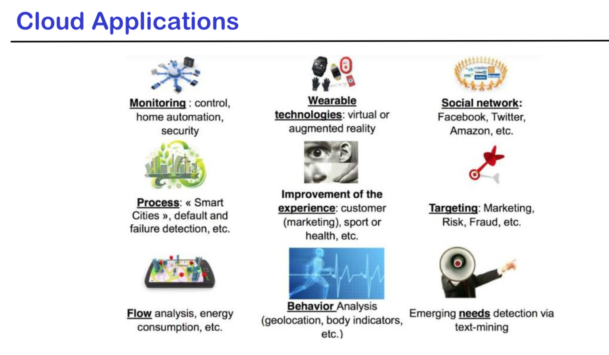
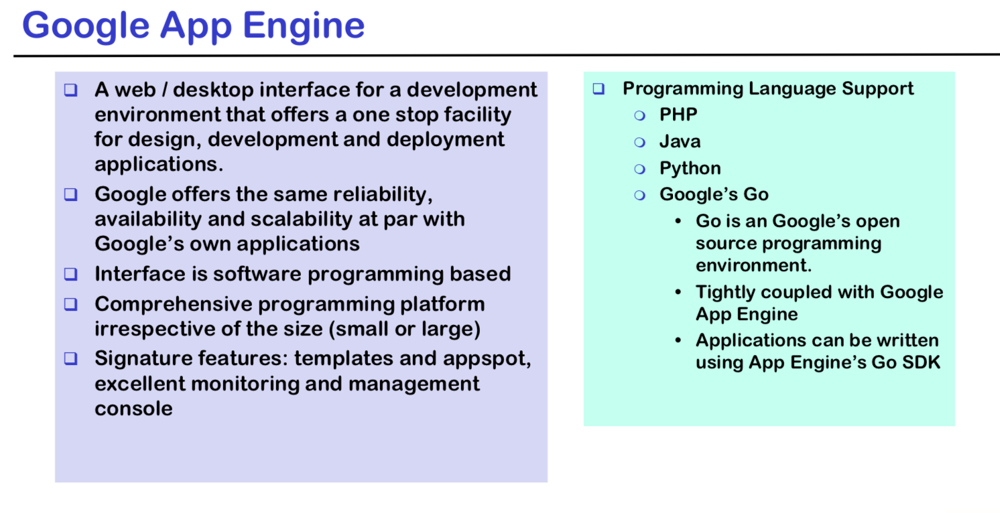
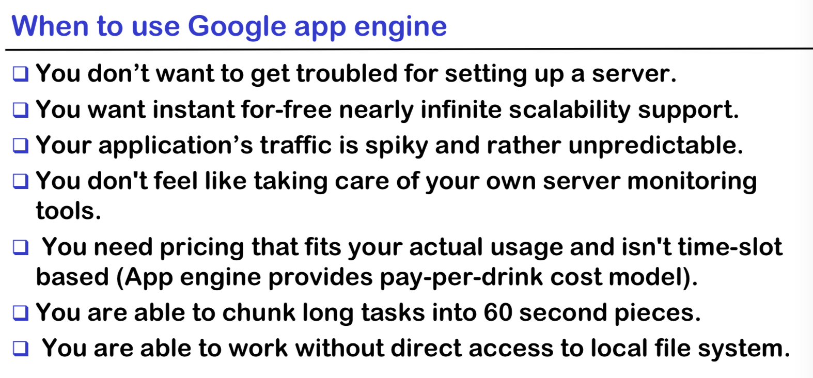
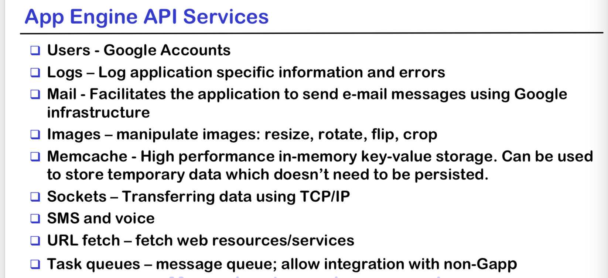

# Lecture 2








## Google App Engine

> **Platform as a Service (PaaS)** cloud computing platform for developing and hosting.

> **Platform as a Service** identifies the collection of **tooling, run-time and development environment, pluggable software componentry that put together**. You can deploy your application in the cloud.

**Advantage:**

- Easy to build
- Easy to maintain
- Easy to scale as the traffic and storage needs to grow.


## What does PaaS Offer ?

- **High-level runtime environments for running applications**
  - Virtual machines, OS, ...
- **Ready to use components to plug into your applications**
  - Develop **core logic, faster application, service building pattern**
- **Specific programming models for development**
  - Target **specific technology or application class**
- **Tooling supporting the software life-cycle development**
  - Source control, Build services, delopyment services, deployment services, dashboard monitoring...

**Runtime envoronments:**

 - Java on J2EE
 - NodeJS on Express/ Strongloop
 - Ruby on Rails
 - Python on Flask

**Ready to use components:**

- Logging and monitoring
- Data stores (SQL, NoSQL, key-value..)
- Job Management and workflow services
- Message queues and notifications

**Programming models**

	- Python: Flash, Pyramid, Django






# App Engine

- Handle **HTTP(S)** requests, nothing else

  - **Think Remote Procedure (RPC)": request in, processing, response out.**
  - **Works well for the web and AJAX; also for other services**

- **Configuration is simple**

- Everything is built to scale:

  - **infinite apps, requests/sec, storage capacity**
  - APIs are simple.

  ​	



## Google notable tools — refer to lecture notes.

## App Engine Features

- **DataStore** 
  - Provides No-SQL schema-less object based data storage, with a query engine and atomic transactions
- **Cloud SQL**
  - Provides a relational SQL database service similar to MySQL
- **BigQuery**
  - Provides super-fast, SQL like queries over massive datasret
    - **BigQuery** is Google's **fully managed, petabyte scale, low cost enterprise data warehouse for analytics**
- **Endpoints**
  - allow to generate APIs and client libraries to simplify client access to data from other applications.
  - Easy to create a web backend for web clients mobile clients such as Android or Apple's iOS

# Creating application

## PHP

app.yaml

```yaml
app.yaml file:
	runtime: php55 api_version: 1
handlers: 
	- url: /.*
	script: helloworld.php

```

helloworld.php

```php
<?php
	echo 'Hello, World!';
?>
```

## Python

app.yaml

```xaml
runtime: python27
api_version: 1
threadsafe: true
handlers: 
	- url: /.*
	script: main.app
```


main.app

```python
import webapp2
  class MainPage(webapp2.RequestHandler):
        def get(self):
		self.response.headers['Content-Type'] = 'text/plain' 
        self.response.write('Hello, World!')
app = webapp2.WSGIApplication([ 
    ('/', MainPage),
], debug=True)
```

## Deploy

```console
gcloud config set project PROJECT_ID
gclodu app deploy 
gcloud app browse
```


# Amazon - refer to lecture slides

## Auto scaling

- The auto scaling services provide means to tune application. This service enable us to collect the information required to define policies
- Configurable:
  - Maximum size of instances for scale out
  - Maximum size of instances for scale down
  - CPU utilizations
  - Memory uasges
  - Throughput


## Scalability

**Vertical Scalability**

 - Deploy the application on more powerful hardware.
 - Restart the instance with a different hardware setup

**Horizontal Scalability**

- Deploy multiple instances of the same application and making them share the same internet access
- This task changes in design, since some components of the application may be shared accross the instances

## Elastic Scalability

- is the ability to **grow and shrink the resource allocation or capacity of a system. Asa result of dynamic changes in demand, for the purpose of maintaining a defined performance throughput target**
- **Requirements**
  - Real-time monitoring
    - Else, we have no real clue on when to change the existing resource allocation
  - Dynamic provisioning
    - Else, we have no means through which modify application's performance.

## Load Balancing

- Distribute workloads accross multiple computing resources, computer… with the aim to optimize the resource use, maximize throughput, minimize response time
- Using **multiple components with load balancing instead of single component `increase reliability and availability throughreduncy`**
- Enables you to achieve greater levels of fault tolerance in your applications.