# Lecture 3: Cloud System Architechtures

## Centralized computing

- All computer resources **are centralized** **in one physical system**
- All resources (processors, memory and storage) are tightly coupled within **one intergrated OS**
- **Example:*
  - A single printer in a network of computers

## Parallel computing

- Multiple processes **can run in parallel using a shared memory**
- All processors are tightly coupled with centralized memory
- Inter-processor communication is accomplished through shared memory or via message passing
- A computer system capable of parallel computing (has multiple processors) is commonly known as parallel computer.

> Shared memory but the task is seperated to different CPU

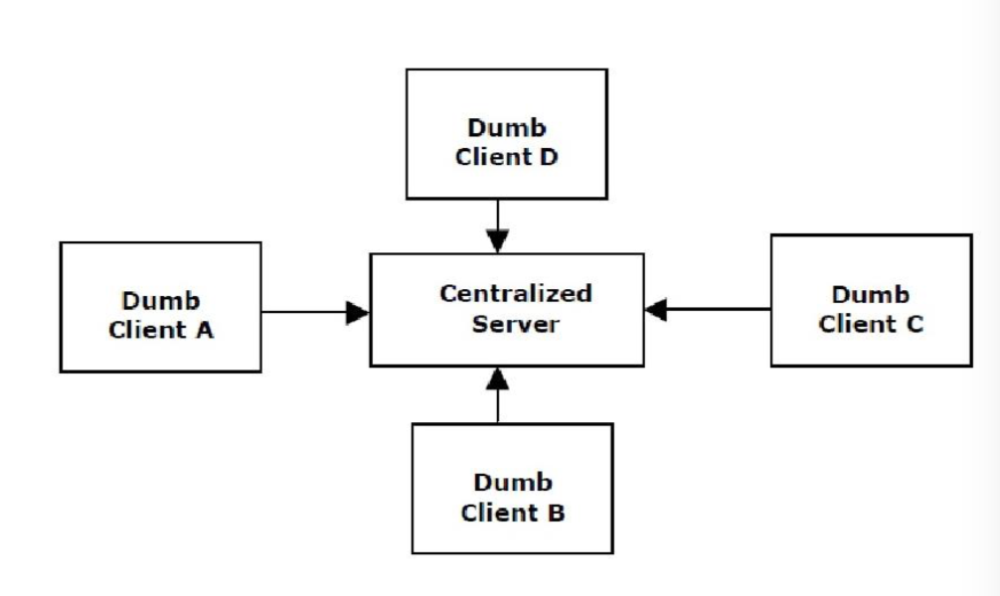

**Example:**

- Science computation
- Digital Biology
- Aerospace
- Resources Exploration

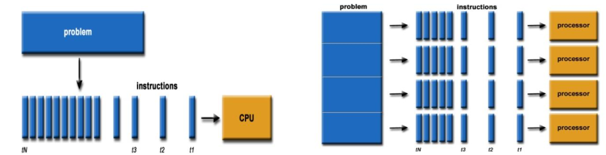

## Distributed Computing

- Consists of multiple autonomous (self-controlling) computer
- Each computer **has its own private memory**
- Communicate through a computer network
- Information exchange is distributed via **message passing**

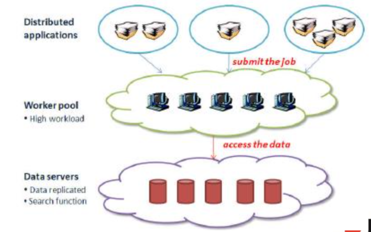

## Grid computing

- A variation of **distributed computing**
- **Large scale**
- **Cross organizational**
- **Geographically distributed**
- **Distributed Management**
- **Specify in two categories:**
  - computational
  - P2P grids

## Peer-to-peer (P2P)

- A **client-oriented network** instead of server
- Every node acts as **both client and server**
- "peers" are computer systems which are connected to each other via the internet
- Files can be shared directly between systems on the network without the need of server.
- Decentralized and distributed

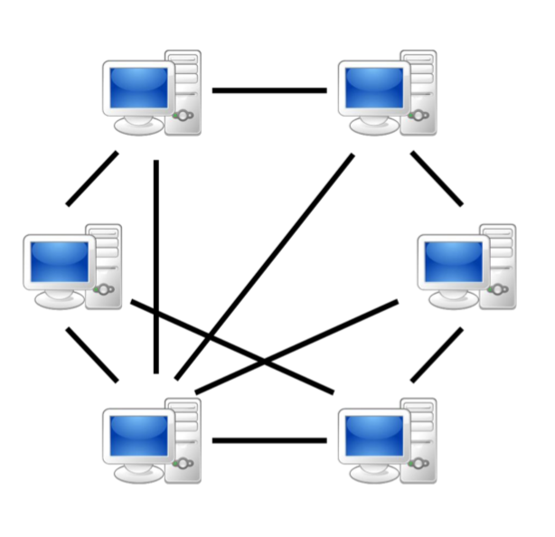

- **All client machines act autonomously to join and leave the system freely**
- No master-slave relationship exists among the peers
- No central database
- P2P network, all clients provide resources including computing power, storage space and I/O bandwidth
- **No peer machine has a global view of the entire P2P system**
- Does not use a dedicated interconnection network
- **Example:** BitTorrent
- **Problem**: Because it's not centralized, managing is difficult.

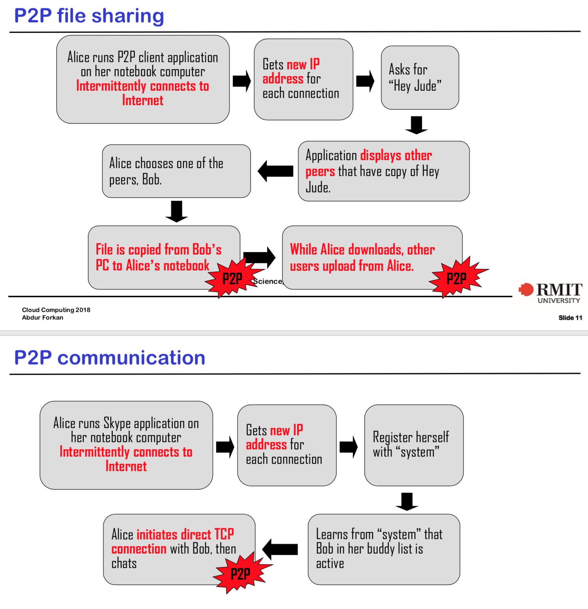

# Cloud computing

- Can be centralized or distributed

  - Can be built with physical or virtualized resources over large data center that are centralized or distributed

- Applies parallel or distributed computing or combination of both

- Provisioned on-demand

- Service guarantee

- Three layer services

  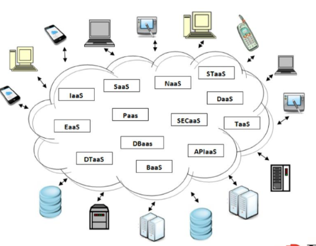

## Cluster Computing

- Tightly coupled.
- REsources are homogenous/identical
- Work together for a specific job
- Each node of same node perform same task (unlike grid and distributed computing)
- Clustering explores massive parallelism at the job level and achieves high availability (HA) through stand-alone operation.

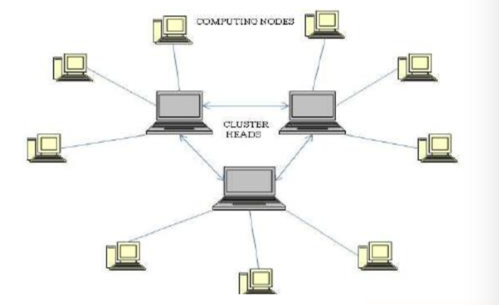

## Ubiquitous computing

- **Wireless communication** between the components
- reers to computing with pervasive devices at any place and time using wired or wireless communication.
- also known as **pervasive computing**
- **Example:**
  - Sart Traffic Light
  - Home automation System..

## Internet of Thing (IoT)

- All computing paradigms over internet
- a networked connection everyday object including computers, sensors, humans
- **The IOT is supported by internet clouds to achieve ubiquitous computing with any object at any place and time**

## Edge computing

- **Local processing before going to the cloud**

- Include the concept of IoT

- **Data from IoT devices analyzed at the edge** before go to cloud

- In edge computing sensors controllers and other connected devices collect and analyze IoT data themselves or transmit it to nearby computing device.

  (server, laptop, rpi)

  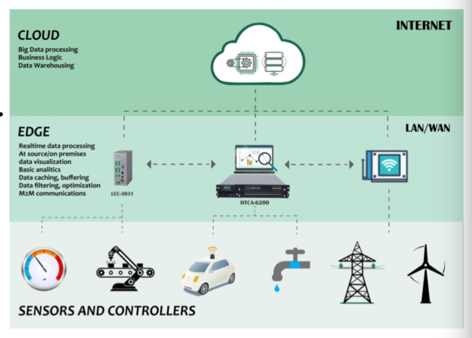

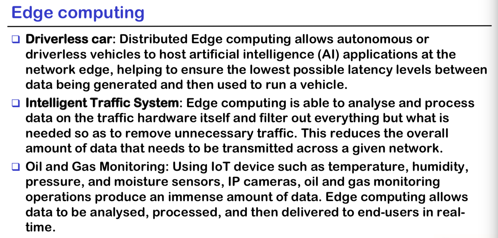

## Fog computing

- A small cloud before data go the actual cloud
- Enterprise network
- Provide computing, storage and networking services for data processing. 

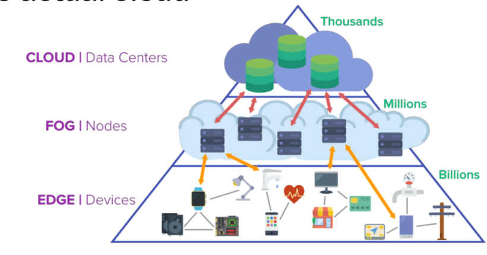

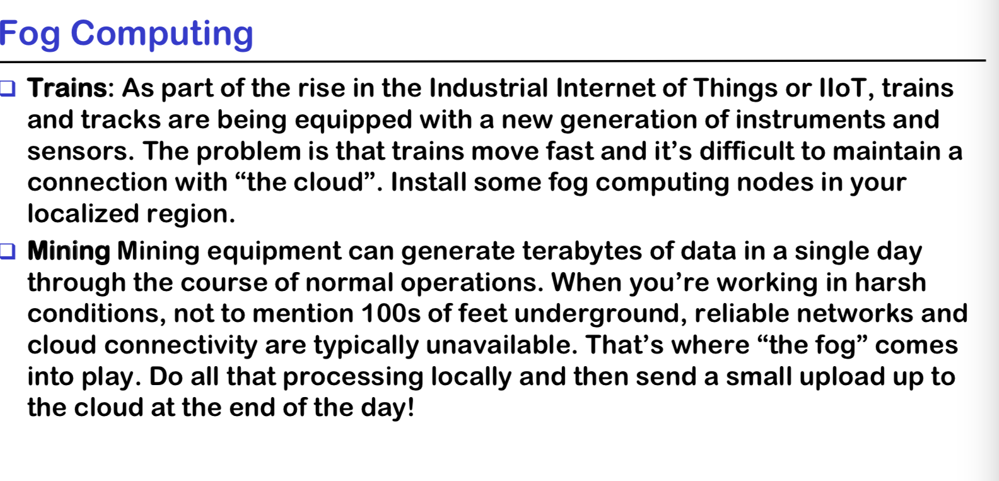

## Service - oriented architecture (SOA)

- Services are provided to the other components by application components througha  communication protocol over the network.

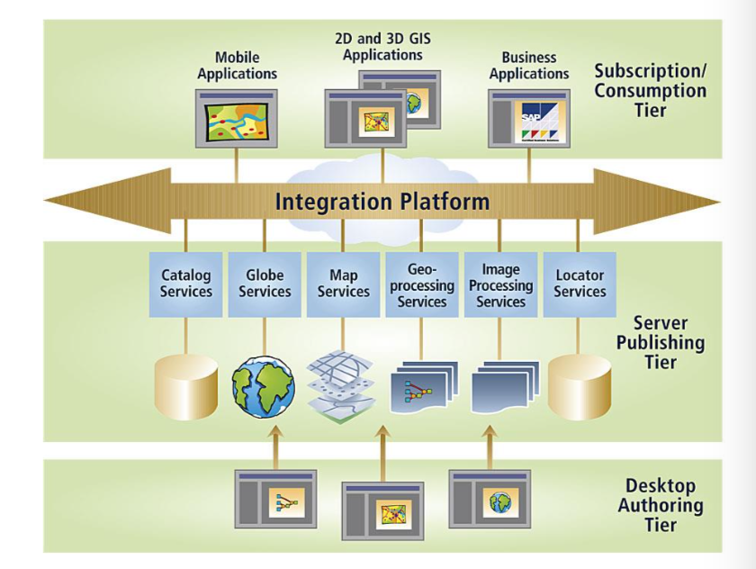

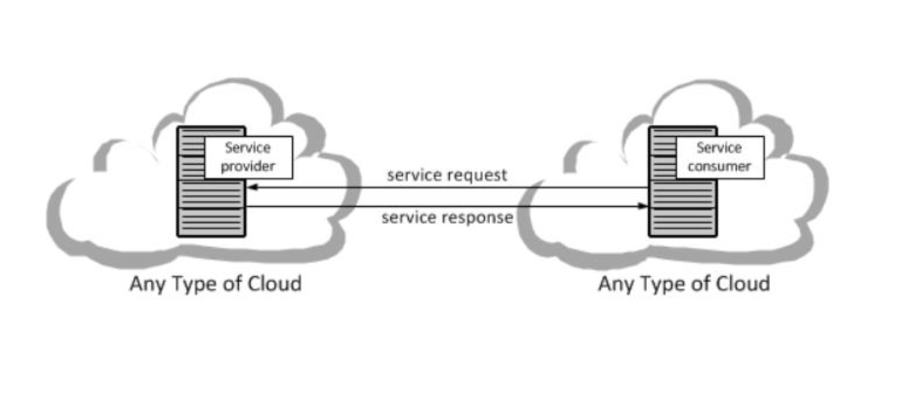

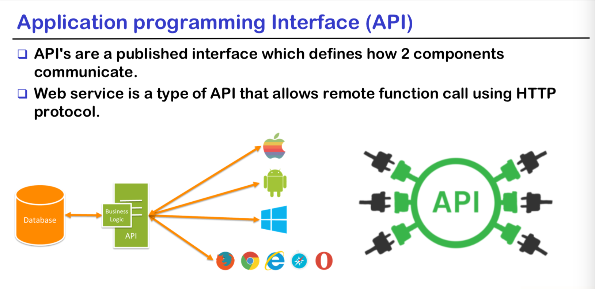

## Representational state transfer (REST)

- Is a software architecture style for distributed system
- The RESTful API exposes a set of resources which identify target of interaction with its client
- 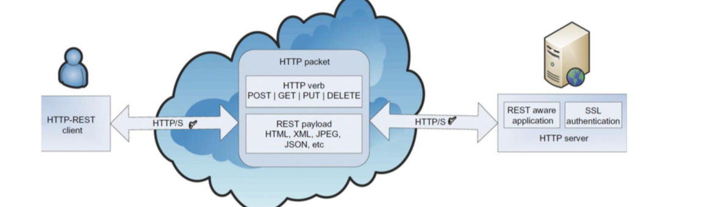

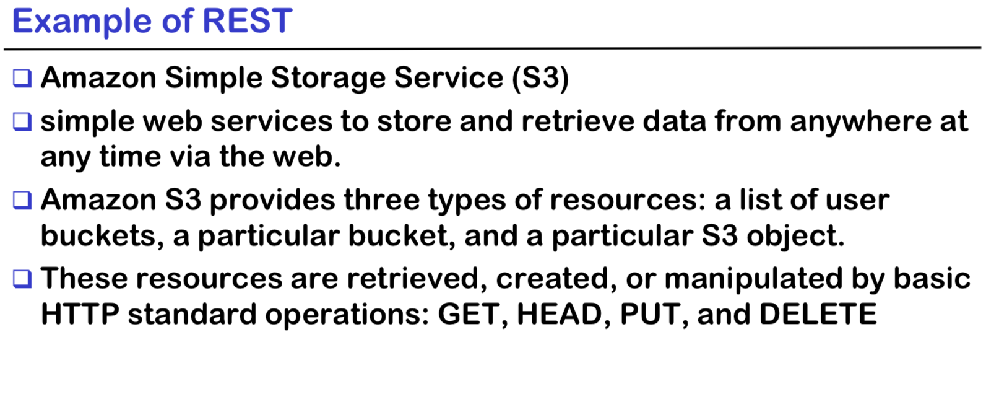

