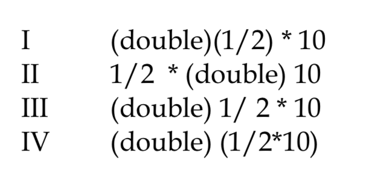
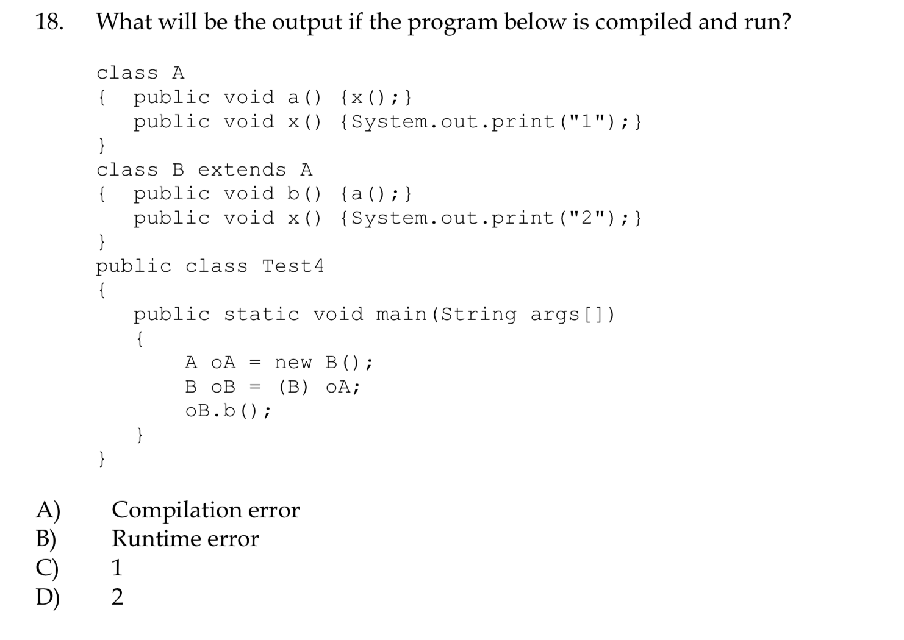
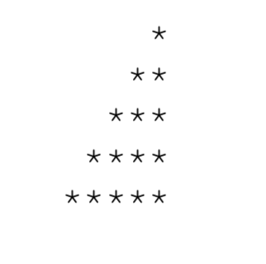
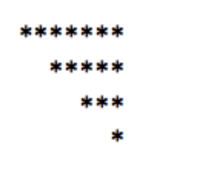

#  Shitty Errors I made

```java
public class TestSwitch
{
    public static void main(String args[]) {
        int x = 3;
        int sum = 0;
        switch (x) {
            case 2: sum ++;
            case 3: sum ++;
            case 4: sum ++;
                break;
        }
        System.out.println(sum);
    }
}
```

The answer is 2.

Since it's going to pick up case 3, and run to 4. So the answer is 2.


- **In a static method, can't call non-static method**. **And all the variable that used in a static method has to be static as well**.
- **Can implement multiple interface but can only extends one class.**

- **If use input.nextLine() then after it should be System.out.print() because the `\n` will be added to the print**

- **Abstract class can have both abstract method and normal method**.
- Abstract class can have constructor just like other normal class, just can't initialize it. This is useful when there are classes that want to extend from the abstract class.   
- **In abstract class**, you **can initialise the array** but can't initialise the element.

For example:

```java
Pet house[] = new Pet[4];
house[0] = new Dog();
```

- Method that extends from abstract class can have different parameter's name:

  ```java
  abstract class:
  public abstract void mustHave(String ok);
  extends class:
  public void mustHave(String notTheSameOk) {
      // do stuff;
  }
  ```


## When dealing with file reader

- Always wrap them into a try-catch block

  **What variables you need to create ?**

  - **File** inputFile = new **File**("test.txt");
  - **Scanner** filePointer = new **Scanner**(inputFile);
  - **String** content = filePointer.nextLine();
  - filePointer.close();

  **Can do** While(inputPointer.hasNextLine()) to iterate through the file.

## When dealing with file writer

- Always wrap them into a try-catch block as well.

  **What variables you will need to create ?**

  - **File** newFile = new **File**("test.txt");
  - **PrintWriter** fileWriter = new **PrintWriter**(newFile);
  - fileWriter.println("hihihi");
  - fileWriter.close();

  **Always close fileWriter**


## When dealing with file appending

- Always wrap in try/catch block

  **What variable you need to create ?**

  - **FileOutputStream** newFile = new **FileOutputStream**("test.txt", **true**);
  - **PrintWriter** fileWriter = new **PrintWriter**(newFile);
  - fileWriter.println("something");
  - fileWriter.close()

  **Always close fileWriter**

# StringTokenizer

This is just a quick tutorial, basically it does the same thing when you use split and for loop. But supposed to be faster? 

first

```java
import java.util.StringTokenizer;
```

Then set a string

```java
String test = "this is a string";
```

**How to use**:

- Initialise the StringTokenizer:

  ```java
  StringTokenizer token = new StringTokenizer(test);
  ```

  Default delimeter is  " "

- Or can be use like this

  ```java
  StringTokenizer token = new StringTokenizer(test, "|");
  ```

  Use `|` as delimeter

- Or:

  ```java
  StringTokenizer token = new StringToenizer(test, "|", true)
  ```

  if use true, delimeter will count as token as well, default is false.

### methods

- int countTokens():
  - return the number of token (number of splitted string);
- boolean hasMoreElements() && boolean hasMoreTokens():
  - check if there are still more tokens -
- nextElement() && nextToken()
  - To iterate to next element

**Example**

```java
public static void main(String args[]) {
    String test = "this is a string";
    StringTokenizer token = new StringTokenizer(test);
    while(token.hasMoreTokens()) {
        System.out.println(token.nextToken());
    }
}
```

> This
>
> is 
>
> a 
>
> string

# Double shit



- ```java
  (double)(1/2) * 10
  ```

  This one, `1/2` will be executed first, since it's `int` - by default, it will be `0`.

  **(double) (0) = 0.0** x 10 = 0.0

  Ans: 0.0


- ```java
  1/2 * (double) 10
  ```

  1/2 = 0 x (double) 10 = 0 x 10.0 = 0.0


- ```java
  (double)1/2 * 10
  ```

  (double)1/2 = 0.5

  0.5 x 10 = 5


- ```java
  (double)(1/2 * 10)
  ```

  1/2 = 0.

  0*10 = 0

  (double)0 = 0.0


**!a && !b == !(a||b)**



In here we're triggering b(), in which it's calling a().

But from a() it's calling x().

Which means it's calling x() in B, not a().

So the result is 2.

# Overloading

Overloading is when the method name is the same, but the arguments are different.

# Star drawing shit



**Simple way**

```java
int star = 1;
int space = 4;
for(int row = 0; row < 5; row++) {
    for(int s = 0; s<space; s++)
        System.out.print(" ");
    for(int i = 0; i < star; i++)
        System.out.print("*");
    System.out.println("");
    star++;
    space--;
}
```

**Complicated way**

```java
for (int r = 5; r > 0; r--) {
    for (int s = r-1; s > 0 ; s--) {
        System.out.print(" ");
    }
    for (int i = 0; i < 6-r; i++) {
        System.out.print("*");
    }
    System.out.println("");
}
```



```java
int star = 7;
int space = 0;
for (int r = 0; r < 4; r++) {
    for (int i = 0; i < space; i++) {
        System.out.print(" ");
    }
    for (int i = 0; i < star ; i++) {
        System.out.print("*");
    }
    star-=2;
    space+=2;
    System.out.println();
}
```

