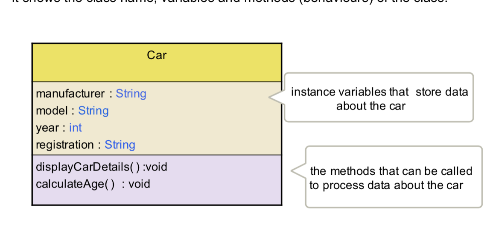

# Lecture 2

## String + Scanner.md

## Escape Characters

For printing on the screen if you want to print any special characters. Use `\`

```console
\" double quote
\' single quote
\\ Blackslash
\n New line
\r Go back to the beginning of the current line and write
\t whitespace tab
```

```java
System.out.print("1+1 \r is smaller than 2+2" );
```

>  is smaller than 2+2

## Format output

use `printf`

```java
double n1 = 10.3249d;
System.out.printf("number: %.2f",n1);
```

> number: 10.32

| format | type         |
| ------ | ------------ |
| %c     | character    |
| %d     | int          |
| %f     | float,double |
| %s     | string       |

**To add space in front:**

```java
double n1 = 10.3249d;
System.out.printf("number: %10.2f",n1);
```


there is total of 10 characters after `number:`

# Class

Let say you want to create a car class that has following attribute:



The code will be like this

```java
public class Car {
    String manufacture, model, registration;
    int year;
    
    public void displayCarDetails() {
        
    }
    public void calculateAge() {
        
    }
}
```


**This will be saved in a seperate file Car.java**

There will be another .java file contains the main() method to run the program.


## Creating a new object in class

```java
Car matiz = new Car();
martiz.manufacture = "Martiz";
```


## Full example

Car_main.java

```java
public class Car_main {
    public static void main(String[] args) {
        Car martiz = new Car();
        martiz.name = "Martiz Models 1938";
        martiz.year = 2000;
        martiz.display();
    }
}
```

Car.java

```java
public class Car {
    String name;
    int year;
    public void display() {
        System.out.println("Car name is: " + name);
        System.out.println("Car year is: " + year);
    }
}
```

> Car name is: Martiz Models 1938
> Car year is: 2000

