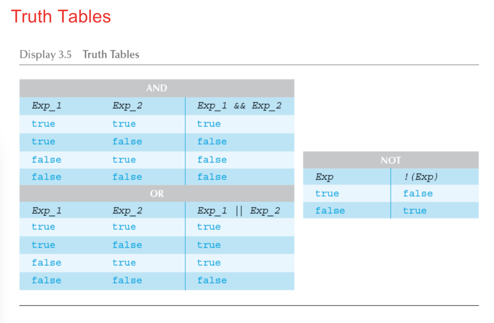

# Lecture 3

## Switch

```java
int month = 8;
String monthString;
switch (month) {
    case 1: monthString = "January";
        break;
    case 2: monthString = "February";
        break;
    case 3: monthString = "March";
        break;
    case 4: monthString = "April";
        break;
    case 5: monthString = "May";
        break;
    case 6: monthString = "June";
        break;
    case 7: monthString = "July";
        break;
    case 8: monthString = "August";
        break;
    case 9: monthString = "September";
        break;
    case 10: monthString = "October";
        break;
    case 11: monthString = "November";
        break;
    case 12: monthString = "December";
        break;
    default: monthString = "Invalid month";
        break;
}
```

- remember to `break` at any case. 
- `default`case is like `else`.


## String comparisons - check String.md



## Exit method

`System.exit(0)` - kill the program

```java
if (numberOfWinners == 0) {
    System.out.println ("Error: Dividing by zero.");
    System.exit (0); //kill the program }
else {
    oneShare = prizePool / numberOfWinners; System.out.println ("Each winner will receive $" +
    oneShare);
}
```

## Array

### int[] array

```java
int[] anArray;
anArray = new int[10];
```

Assign values

```java
anArray[0] = 1;
anArray[5] = 3;
```

or

```java
int[] anArray = {1,2,3,4,5,6}
```

no need for size;

### double[] array

```java
double[] array = new double[7]
```

### String[] array

```java
String[] array = {"hi","this"}
```

