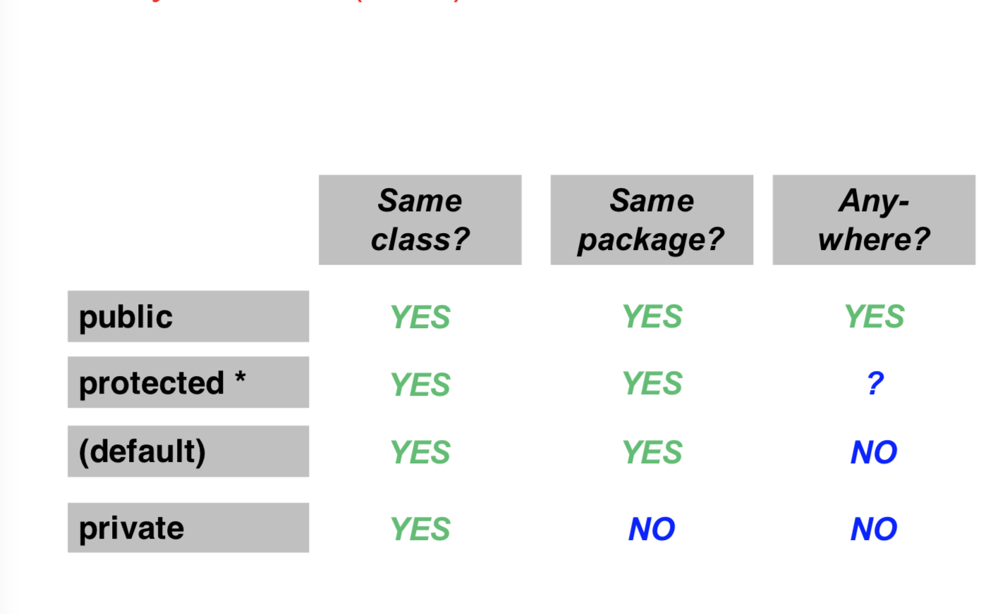

# Constructure

```java
public class Dog
{
    public String name;
    public String breed;
    public int age;
    
    public Pet()
    {
        // default constructure
        System.out.print("A new hero was created");
    }
    
    public Pet(String initialName, String initialBreed, int initialAge)
    {
        // parameter constructure
        name = initialName;
        breed = initialBreed;
        age = initialAge;
    }
}
```


- When you first call the class, it will runs the default Constructure. You can still keep it if you just want.
- The default constructure will works if you run `Dog blackDog = new Dog()` without any parameters.
- If you do `Dog blackDog = new Dog("Fluffy","abcde",9)` it will call the constructor.

# Encapsulation

`public` : can be accessed by any other classes;

`private`: can only be accessed from inside the class.

`protected`: can be accessed by all other classes within the same package.



**Example**

```java
public class Rectangle
{
 	private int width;
    private int height;
    
    public void setup(int width, int height)
    {
        this.width = width;
        this.height = height;
    }
    
    public Rectangle(int width, int height)
    {
    	this.width = width;
        this.height = height;
    }
    
    public int getArea()
    {
        return width*height;
    }
}
```

```java
public static void main(String[] args)
{
    Rectangle box = new Rectangle();
  //  box.width = 5 wont work
  //  box.height = 5 wont work
    box.setup(15,5);
    System.out.println(box.getArea());
}
```


**When you create an object, it will be pointer type. Thus, can't assign 2 objects**

**Example**

```java
Rectangle box1 = new Rectangle(); box1.setup(5,3);
Rectangle box2 = new Rectangle(); box2.setup(3,2);
//box1 = box2 this is assigning pointer box1 to box2, not modifying box1.
```


# Class array

```java
public static void main(String[] args)
{
    Rectangle[] arr = new Rectangle[5];
    arr[0] = new Rectangle(300,200);
}
```

