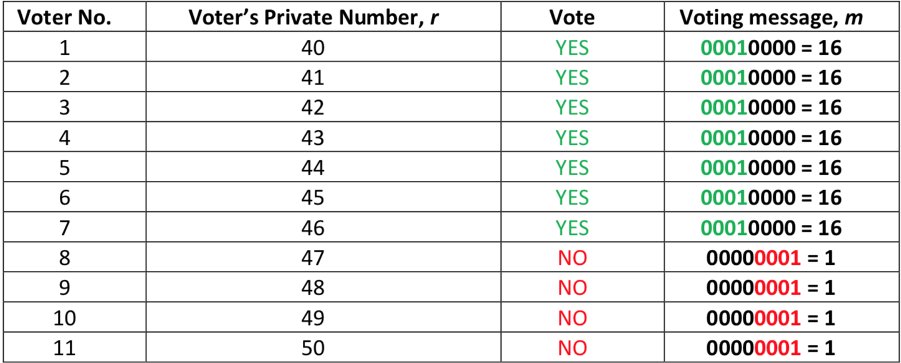
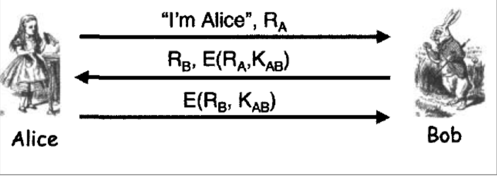
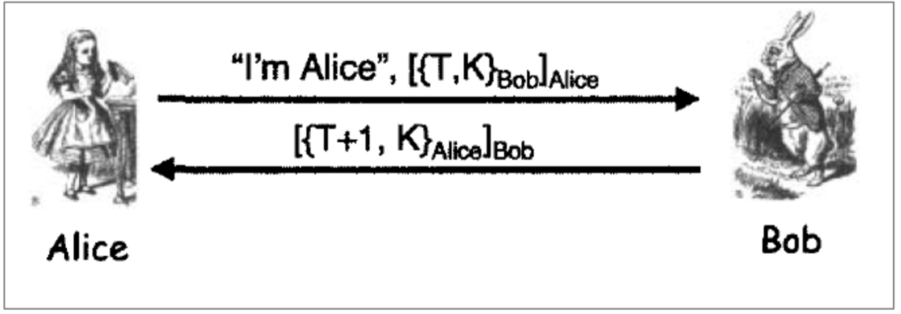

###### Student name: Thang pham

###### Student id: s3619352

## Q1

General information collected by Voting Booth:

- 11 Votes - 7 YESs, 4 NOs

- `p=59`, `q=97`, `g=5724`
- 

These information are then sent to Voting Server to encrypt.

### Generating private and public key

Voting authority will generate the public and private key.

$n = p.q = 59*97 = 5723$

So public key: $(n,g) = (5723,5724)$

$λ = lcm(p-1,q-1) = lcm(59-1,97-1) = lcm(58,96) = 2784$

$k = L(g^{λ}modn^2) = L(5724^{2784}mod(5723^{2})) = 2784$

$µ = k^{-1}mod(n) = 2784^{-1}mod(5723) = 4763$

So private key: $(λ,µ) = (2784,4763)$

### Encryption.

The Voting Server uses Paillier to encrypts its data. Thus, we have formular:

$c=g^mr^nmod(n^2)$

Applied for the first voter:

$c1 = 5724^{16}40^{5723}mod(5723^2) = 22848230$

likewise, $c2 = 5724^{16}41^{5723}mod(5723^2) = 24785522$

...

Follow the same pattern, we will achieve the following result:

| Voter No. | Private number (r) | Message | Encrypted Vote |
| --------- | ------------------ | ------- | -------------- |
| 1         | 40                 | 16      | 22848230       |
| 2         | 41                 | 16      | 24785522       |
| 3         | 42                 | 16      | 19405678       |
| 4         | 43                 | 16      | 21780777       |
| 5         | 44                 | 16      | 21683720       |
| 6         | 45                 | 16      | 4823473        |
| 7         | 46                 | 16      | 8614744        |
| 8         | 47                 | 1       | 1697533        |
| 9         | 48                 | 1       | 6536971        |
| 10        | 49                 | 1       | 21944072       |
| 11        | 50                 | 1       | 6610614        |


### Homomorphic calculation

After Voting Server encrypted all the data, it goes through homomorphic calculation and then send the result to Voting Authority.

Thus we have a set of encrypted vote:

```
[22848230,24785522,19405678,21780777,21683720,4823473,8614744,1697533,6536971,21944072,6610614]
```

Thus we have:

$(22848230*24785522*19405678*21780777*…*6610614)mod(5723^2)=22948006$

So `Voting Authority` will receive the result ==C = 22948006==

#### Decryption

Voting Authority will decrypt the message ==C=22948006== as follow:

$m = L(C^{λ}mod(n^2)*µmod(n)$

So $m = L(C^{λ}mod(n^2))*µmod(n) = L(22948006^{2784}mod(5723^2))* 4763 mod (5723)$

= 116.

Convert to binary, we have 116 = **0111 0100**

So 7 voted YES, and 4 Voted NO

## Q2.1

Using RSA encryption with

- `p = 10193`
- `q=8287`
- `e=5903`
- `m =123456`

First, Bob calculates $n=pq = 84469391$

next, he calculate $Ф = (p-1)(q-1) = 84450912$

So public key $(84469391,5903)$


Next, he continues to generate private key $d$ that $d.e = 1mod(Ф) $

so $d = e^{-1}mod(84450912) = 39686063$

#### Signing the message

Bob then signs his message using

$s = m^{d}modn = 123456^{39686063} mod (84469391) = 74113277$

Bob sends $(m,s) = (123456,74133277)$ to Alice


### Verifying the message

Alice verify using $(84469391,5903)$

$m' = s^emodn = 74113277^{5903}mod(84469391) =123456$

## Q2.2

Using Elgma encryption algorithm with:

`m = 5432`

`p=9721`

`g=1909`

`x=47`

First, Bob will calculate $y = g^xmodp = 1909^{47}mod(9721) = 633$

He will sends $(p=9721,g=1909,y=633)$ to Alice.


### Signing the message

Bob selects a random number K that $1≤k≤p-2 ≈ 1≤k≤9719$ 

and $GCD(k,p-1) = 1$ so $GCD(k,9720) = 1$

Let select `k=7`

Bob then computes signature parameter

$r = g^kmodp = 1909^{7}mod9721 = 951$

$s = k^{-1}(m-x*r)mod(p-1) = 7^{-1}(5432-47*951)mod9721= 9665$

So bob sends $(m=5432,r=951,s=2723)$ to Alice.


### Verifying the message

Alice checks if $r ≥ 1$  and $r≤p-1$ which r = 951 satisfies larger than 1 and smaller than 9720.

Next, Alice calculates $v = g^m mod p = 1909^{5432}mod(9721) = 5055$

then she calculates $w = y^r.r^smodp = 633^{951}.951^{9665}mod(9721) = 5055$


## Q2.3


Message.txt

```txt
Was every secret code used during the war cracked? The answer to that final question is a stunning surprise: the skilled code breakers of the time weren’t able to crack every coded message sent during World War II. In fact, until recently, some messages sent by German agents were still coded, the world and the Allied Forces unsure of what the contents said.
```


$h(M) = dbafc095e552176dd482cea445d199a2$

And then he converts the hash into decimal: `292013489125751596553767941623740733858`

Using RSA encryption with

`p = 307699126915021078949717556805305347641`

`q = 286189067004968539490940912607240844261`

`M = 292013489125751596553767941623740733858`

`e=47`

First, we have $n = p*q = 88060126050053286133358329588325261416508643838108904670297433897418944738301$

$Ф = (p-1) * (q-1) = 88060126050053286133358329588325261415914755644188915051856775428006398546400$

Thus, Bob public key is:

$(n,e) = (88060126050053286133358329588325261416508643838108904670297433897418944738301,47)$

Private key $d = e^{-1}mod(Ф)= 28104295547889346638305849868614445132738751801336887782507481519576510174383$

### Signing

Bob then signs his message using the following algorithm

$s = m^dmodn$ 
$=292013489125751596553767941623740733858^{28104295547889346638305849868614445132738751801336887782507481519576510174383}mod(88060126050053286133358329588325261416508643838108904670297433897418944738301) $

$= 86049882927644910814011702713016709134818318032818047653225539478708216829379$

Bob sends $(m,s) = (292013489125751596553767941623740733858,86049882927644910814011702713016709134818318032818047653225539478708216829379)$ to Alice

### Verification

Alice verifies using $(n,e) = (88060126050053286133358329588325261416508643838108904670297433897418944738301,47)$

$m'= s^emod(n) =  86049882927644910814011702713016709134818318032818047653225539478708216829379^{47}mod(88060126050053286133358329588325261416508643838108904670297433897418944738301)$

$m' = 292013489125751596553767941623740733858$ 

Because $m ==m'$ so Alice can verify that the sender is Bob


## Q2.4


## Q4.1

**Trudy's attack hypothesis**



- Trudy will act as Alice, sends Bob `"I'm Alice", RA`
- Bob sends back `RB, E(RA,KAB)`
- Trudy opens a second connection, connect to Bob


- Trudy sends Bob `"I'm Alice", RB`
- Bob sends back ==RC,E(RB,KAB)==
- Now trudy obtains `E(RB,KAB)`, he comes back the the first connection and then sends Bob `E(RB,KAB)`
- Bob will think Trudy is Alice since only Alice has symmetric key K. And let Trudy in.


**Prevention**

Instead of doing `E(R,K)` it's better to do `E(person_name,R,K)`

So it will be like

- Alice sends Bob: `"I'm Alice", RA`
- Bob sends Alice: `RB,E("Bob",RA,KAB)`
- Alice sends Bob: `E("Alice",RB,KAB)`


As a result, if Trudy is trying to trick Bob to send `E("Bob",RA,KAB)`, when Bob decrypts it, he sees his name. Thus he knows someone is trying to spoof Alice.


## Q4.2



**Trudy's attack hypothesis**

- First, Trudy can use Alice's public key to get `{T,K}Bob`
- And then Trudy then sends Bob: `"I'm Trudy", [{T,K}Bob]Trudy`
- Bob then sends trudy back `[{T+1,K}Trudy]Bob`
- Thus, he can get the session key **K**.
- However, this requires Trudy to act in the same clock skew.

**Prevention**

The whole point is to prevent Trudy from getting `{T,K}Bob`

Thus, Alice has to :

- Sends Bob `"I'm Alice", {[T,K]Alice}Bob`
- And then Bob will send back: `{[T+1,K]Bob}Alice`

Trudy will not be able to obtain `[T,K]Alice` since only Bob can sign to decrypt it.