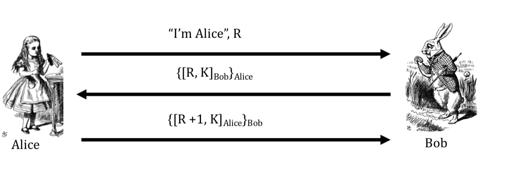

## One-Time Pad Summary

> It's somewhat secure why:
>
>
> - Ciphertext gives **no** useful information about plaintext
>
>
> - All plaintexts are equally likely
> - immune to bruteforce
>
> Condition:
>
> - Pad must be random, used only once.
> - Pad is known only to sender and receiver.
>
> Issue:
>
> - **Pad (key)** is the same size as message, it will be large.

**ISSUES**

> **If you have the cipher text and the plain text, you have the key as well.**

## Stream Ciphers

- Encrypts 1 bit of the plaintext at a time.
- It uses an **infinite stream of pseudorandom** bits as a key
- Its pseudorandom generator should be unpredictable and the key should never be used.
- The **key is less than the original message**. However the security level is also less than One-Time Pad because the key isn't as long as the message. Although, the security level is still strong.

**To reach perfect secrecy requirements**:

- Every bit has to be trully random
- The key can only use one
- The key's length has to be the same as the message

**Why stream cipher not secured**:

- Pseudorandom is not trully random
- Key is generated using an algorithm.
- Key length is smaller than the message.

# Properties of Crypto Hash Function - EXAMINABLE

Crypto Hash function $h(x)$ must provide

- **Compression: ** output length small
- **Efficiency**: $h(x)$ easy to compute for any $x$
- **One-way**: Can't reverse
- **Weak collision resistance**: given $x$ and $h(x)$. It's impossible to find $y$ that $h(y) == h(x)$ // one specific case
- **Strong collision resistance**: it's impossible to find **any** $x,y$ that $h(x) == h(y)$ // general case.

# RSA Homomorphism: Multiplying two number secretly

Use RSA Encryption formula to get C1, C2 from M1, M2.

Multiply C1,C2 get C-Result.

Decrypt C-Result using RSA decryption get result.

# ElGamal Homomorphism: Multiplying two number secretly

USE Elgamal Encryption to get
$C11*C12 => C3.$
$C21* C22 => C4$

and send $(C3,C4)​$ to client.

$result = \frac{C4modp}{(C3)^{x}modp}$ 

#  Signature

## provide integrity (honesty)

RSA signature scheme, Bob will send (m,s) to Alice. 

Alice has to verify for both m and s to make sure that they're all correct and are from Bob.

## provide non-repudiation

> Non-repudiation is the assurance that someone cannot deny something

Bob has the private key d and only him can sign the message.

## Why don't use the same RSA key for both signing and decrypting:

In some protocols, random challenges is signed and sent. Trudy might trick Bob into signing random challenges that actually a message.

Bob will decrypt the message and send it back to trudy.

# Digital certificate

- Contains name of user and user's public key
- It is **signed** by the issuer, a **Certificate Authority** such as VeriSign
  - M = (Alice, Alice's public key)
  - S = $[M]_{CA}$
  - **Alice's Certificate: (M,S)**
- Signature on certificate is verified using CA's public key
  - Must verify that M = {S}CA
>### Notations
>**Sign** message M with Alice's **private key:** $[M]_{Alice}$
>**Encrypt** message M with Alice's **public key: ** {M}Alice

# Blockchain

A block contains

- Previous hash
- Current hash
- Details
  - Received time
  - Delivery time
  - Private ID,...

The first block is called genesis block.

- Previous Hash: 000
- Current Hash
- Details
  - Received time: 000
  - Deliver time: 000
  - Private ID,..

**To check if a blockchain is valid**

- There will need to have an audit manager that will reproduce all the hash to check if the hashes are following the correct result.

# Bitcoin

Bitcoin consists of following:

- Block header
- Hash of previous block header
- Merkle Root:
  - Block's transaction.

In bitcoin, output of one transaction is the input to next transaction.

# Merkle Tree

only the leaves are actual values, nodes and roots are hash.

# Proof of work

So when we hash the block, we hash:

- Previous block value
- Data block (Data of many blocks)
- **Nonce**

We need to find a **nonce** so that the first 3 values of the hash is `000`

# Authentication with symmetric key

1. No authentication:

   

2. Authentication using symmetric key:

   

   - **Problem:** Trudy can capture `E(R,K)` and send it back to Bob to fake Alice.

   

   - **Problem:** Trudy can use parallel connection to fake Alice. One send RA and the other one Send RB. as a result, when Bob sends E(RB,K) he will use it as a login for the first session.

   - 

   - **Solution:** Encrypt your name in the encryption

     

     To prove that you are able to encrypt custom string.

# Public key authentication

**Problem:**

- Trudy can fake Bob, send Alice R and ask for decryption. And then send it back to Bob.

So it's a bad idea to use same key pair for encryption and signing, instead should have:

- One key pair for encryption.
- A different key pair for signing/verifying signatures.

**Solution:**

Session key:

- Normally have a session key as a symmetric key. 

**Problem:**

- No mutual authenticated, they just use each other public key.

**Problem:**

- Everyone can decrypt and get the message using Bob and Alice's public key

**Problem:**

- Everyone can see {R,K}Alice and {R+1,K}Bob
- But it's ok since they can't decrypt.
- can't use man in the middle because:
  - Alice: I'm Alice, R => Trudy
  - Trudy: I'm Trudy, R => Bob
  - Bob: [{R,K}trudy]Bob => Trudy
  - Trudy: [{R,K}Alice]Trudy => Alice
  - Alice: realise it's not decryptable using Bob's public key. Stop the connection. - because it's signed by Trudy.

**Problems:**

Man in the middle attack

# Public Key Authentication with Timestamp T

**Problem:**

- They use Alice's public key to find {T,K}Bob and then:

- 
- Trudy must act within the clock skew.

**Solution:**

or

- Don't expose your K.

> if {} inside,  [] outside with R, Secure.
>
> if [] inside, {} outside with timestamp, secure.

# General model of steganography:

Alice wants to communicate with Bob.

All information can be accessed by Wendy

Alice wants to send a secrete message (m)

First she embeds into a cover-object (c) with stego-key (K)  by using embedding-function (Em).

Get stego-object(S) which carries the hidden message.

# IDS

- to detect attacks before, during and after they occurs.
- How IDS works: Look for unusual activities, detect intrusion.

If smaller than 0.1 then it's normal.