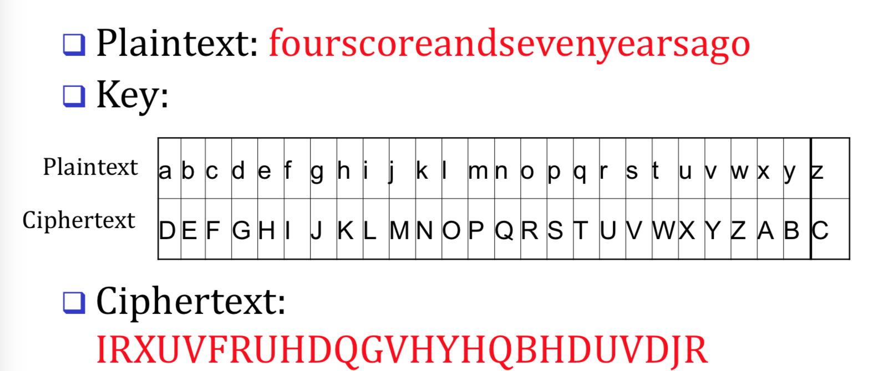
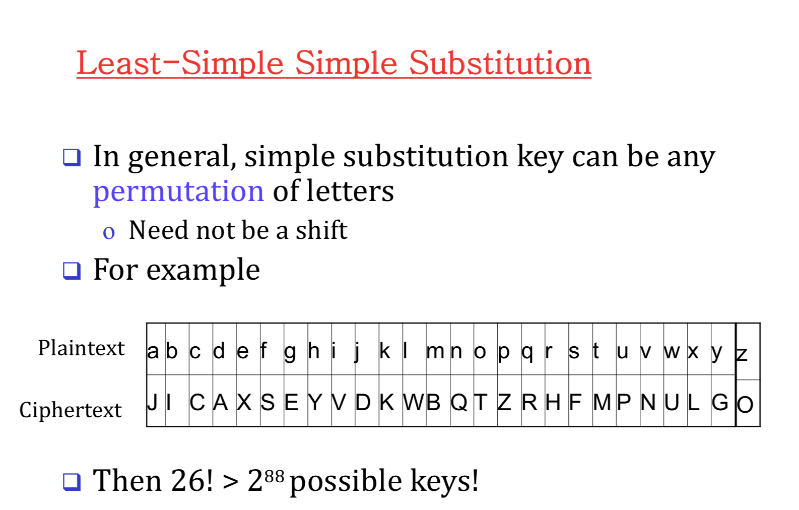
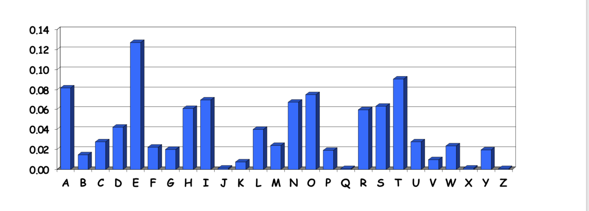
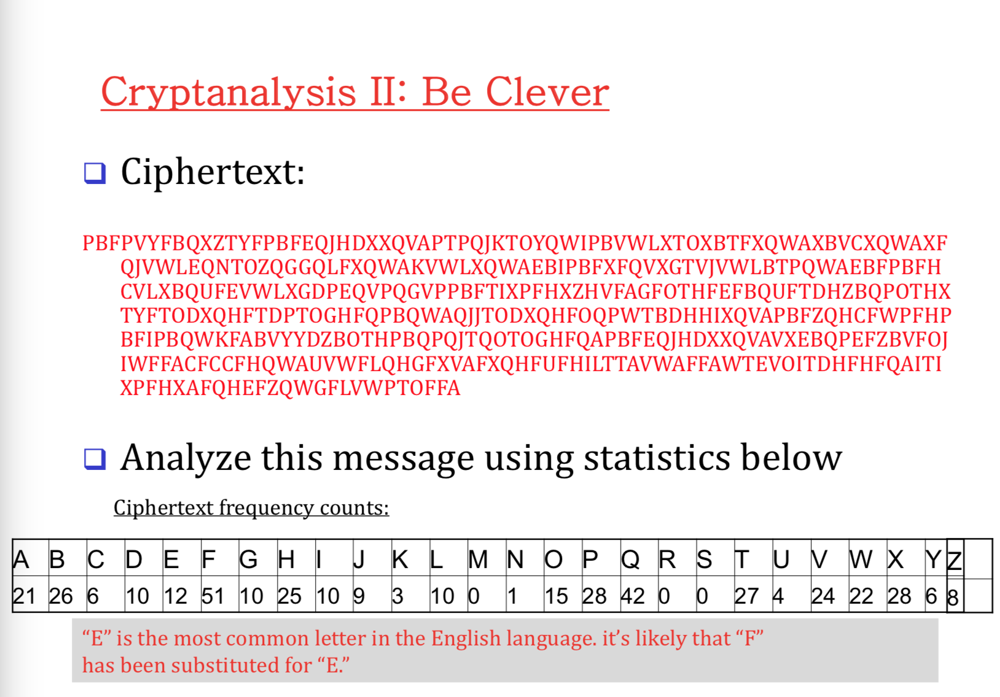
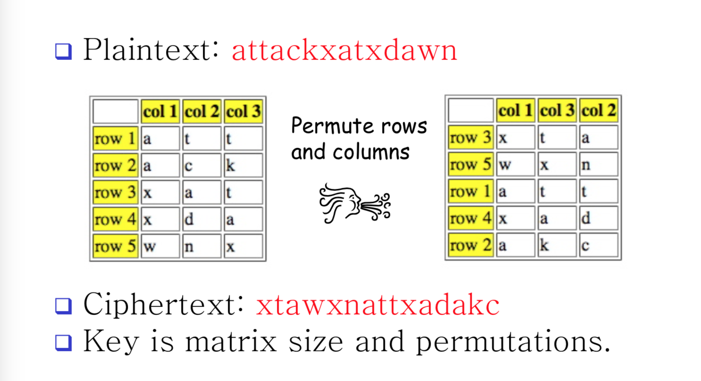
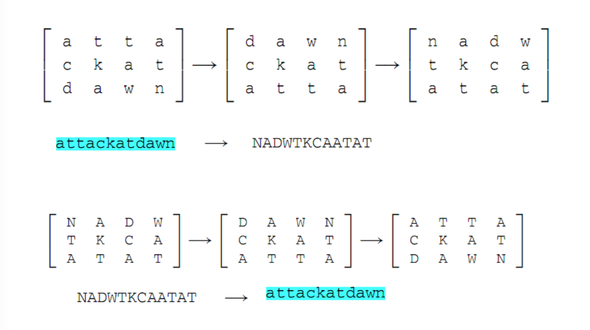

# Intro

### Caesar's cipher

*Shift by 3.*

# Substitution

Instead of shifting choose random characters to represent each plain character. 

***There are 26 characters in English***

=> 26!  possible keys

## So how to solve backwards.

> We use frequency count.

**E** will appear the most in most English paragraph.

>  And then you analyse the given ciphertext. We count to see which one has the highest frequency. If it has the highest. Most likely it's E.

> it's likely that F is substituted for E.

**Cryptosystem is insecure if there is any shortcut attack is known**. The example above is one type of shortcut.

> a secure cryptosystem with a small number of keys could be easier to break than an insecure cryptosystem with a large number of keys. 

**To be secure, key space has to be 2 ^ (2048) .**

# Double Transposition

> Something that is better than the key shift.

Have to agree on the size of the matrix.

Read from left => right. top => bottom.

If there is an empty cell, use the X character to fill in.