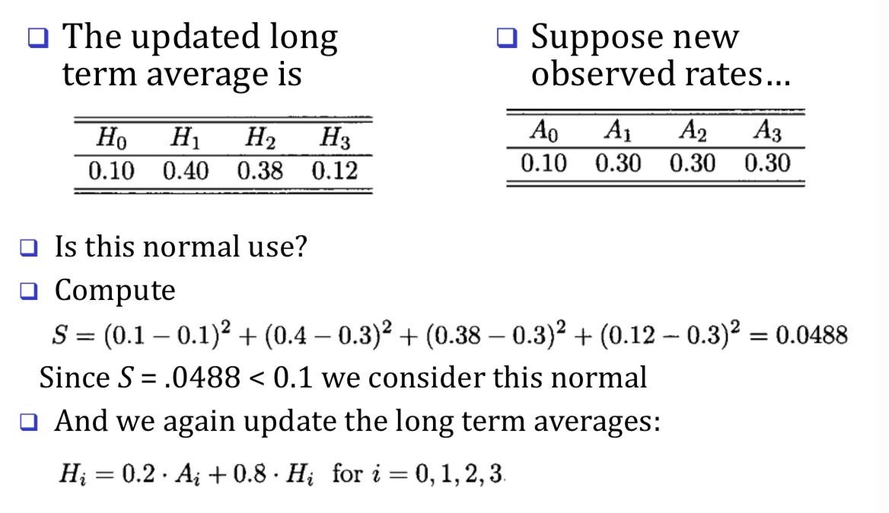

# Lecture 10. Digital Authorization and Intrusion Detection

## Lampson's Access Control Matrix

- Authoriization is a form of **access control**
- Classic view of authorization:
  - Access control lists (ACLs)
  - Capabilitites (C-lists)
    - Subjects (users) index row
    - Objects ( resources) index columns

## Access control lists (ACLs)

**Insurance data** can be read by Alice, Sam, Accounting Program

## Capabilities ( or C-lists )

Alice can **rx, rx, r, rw, rw**

## ACLs vs Capabilities

### ACLs

 - Good when users manage their own files
 - Protection is data-oriented
 - Easy to change rights to a resource

### Capabilities

- Easy to delegate - avoid the confused deputy
- Easy to add/delte users
- More difficult to implement

## Inference control example

- It's disclosing the personal information since it's only one person.

## Naive Inference control

- Remove names from medical records
- But removing names is not enough.

## Less-naive inference control

- Query set size control
  - Don't return an answer if the set size is too small
- N-respondent, k% dominance rule
  - Do not release statistic if k% or more contributed by N or fewer.
  - Example: Avg salary in Bill Gates' neighborhood.
- Randomization
  - Add small amount of random noise to data
- Many other methods - none satisfactory.

## Firewalls and Defense in depth

## Firewalls

## Packet filter

- Operates at network layer
- Can filters báed on
  - Source IP address
  - Destination IP address
  - Source port
  - Destination Port
  - Flat Bits (SYN, ACK, etc)
  - Egress or ingress

## Packet Filter

- Configured via Access control Lists (ACLs)

  

## Intrusion prevention

  - Want to keep bad guys out
  - Intrusion prevention is a traditional focus of computer security
    - Authentication is to prevent intrutions
    - Firewalls a form of intrusion prevention
    - Virus defenses aimed at intrusion prevention
    - Like locking the door on your car

## Intrusion detection

  In spite of intrusion prevention, bad guys will sometime get in

  Infrustion detection systems (IDS)

  - Detect attacks in progress ( or soon after )
  - Look for unusual or suspicious activity

  Who is likely intruder?

   - Maybe outsider who got through firewall
   - Maybe evil insider

  What do intruders do/

  - Launch attacks
  - borrow system resources.

## IDS

  - Approaches:
    - Signature-based IDS
    - Anomaly-based IDS
  - Intrusion detection architectures
    - Host-based IDS
      - Monitor activities on hosts for Known attack (i.e signature), suspicious behavior (i.e anomaly)
    - Network-based IDS
      - Monitor activities on network for known attack(i.e signature),  Suspicious network activity (i.e anomaly)
  - Any IDS can be classified as above
    - In spite of marketing claims to the contrary

## Signature Detection Example (Host based)

- Failed login attempts may indicate password cracking attack
- IDS could use the rule "N failed login attempts in M seconds" as signature
- If N or more failed login attempts in M seconds, IDS warns of attack
- Note that such a warning is specific
- Admin knows what attack is suspected
- Easy to verify attack ( or false alarm )

- Supposed IDS warns whenever N or more failed logins in M seconds
- Set N and M so false alarms not common
- Can do this based on "normal" behavior

- But if Trudy knows the signature, She can try (N-1) login every M seconds
- Then signature detection slows down Trudy but might not stop her

- Many techniques used to make signature detection more rebust
- Goal is to detect "almost" signatures
- For examples, if "about" N logins attempts in "about" M seconds
  - Warn of possible password cracking attempt
  - Can use statistical analysis, heuristics, etc.

### Advantages of signature detection

 - Simple
 - Detect known attacks
 - Know which attack at time of detection
 - Efficient

### Disadvantages of signature detection

- Signature files must be kept up to date
- Number of signatures may become large
- Can only detect known attacks

## Anomaly Detection (Host based)

### Example 1

Suppose we monitor use of three commands:

`read`, `open`, `close`

Under normal use we observe Alice:

`open`,`read`,`close`,`open`,`open`,...

Of six possible ordered pairs, we see four pairs are normal for Alice

`open,read` `read,close` `close,open` `open,read`

If the ratio of abnormal to normal pairs is "too high", warn of possible attack

Could improve this approach by

 - Use expected frequency of each pair
 - Use more than two consecutive commands
 - Include more commands/behavior in the model
 - More sophisticated statistical discrimination

### Example 2

