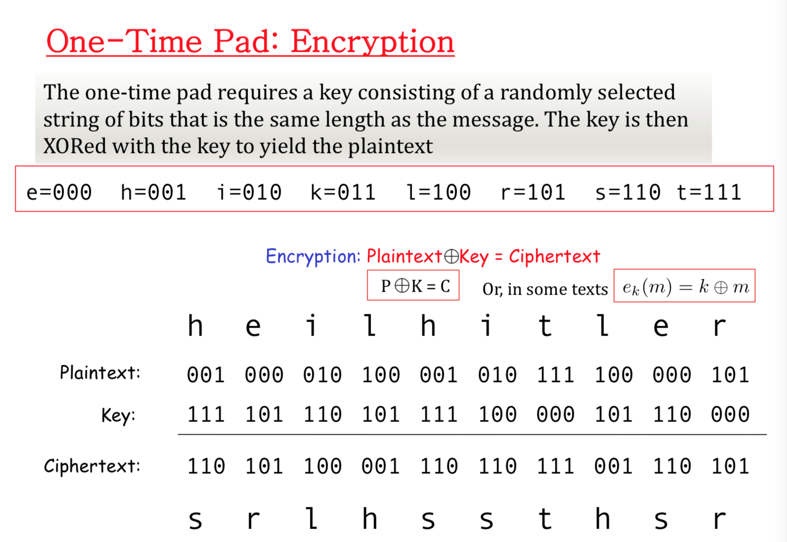

# rLecture 2:  Symmetric Key Cryptography


### Terms:

- `cipher` or `cryptosystem` is used to encrypt the text.
- The output is `ciphertext`
- `decrypt` ciphertext to recover the plaintext.
- `symmetric key` cryptosystem uses the same key to encrypt as to decrypt
- `public key` cryptosystem uses a `public key to encrypt` and a `private key to decrypt`


### XOR - exclusive OR


## One-Time Pad: Encryption

- Convert the plaintext into bits, `a character can be represent as bits`
- Use one `key as bits` and then use `XOR` to get the cipher text.
- You only use the key only once.



> Thus we have the result of `ciphertext` is `srlhssthsr`

## One-Time Pad: Decryption

> From the result of the `ciphertext`. We can decrypt it back


> **XOR for encryption => XOR for decryption**


## One-Time Pad: Decryption by a double-agent


> Sometimes same ciphertext, different key will result to different Plaintext.

## One-Time Pad Summary

> It's somewhat secure why:
>
> 	- Ciphertext gives **no** useful information about plaintext
> - All plaintexts are equally likely
>
> But **not practical** because: 
>
> - **Pad (key)** is the same size as message, it will be large.

**ISSUES**

> If you have the cipher text and the plain text, you have the key as well.

## Stream Ciphers


- Encrypts 1 bit of the plaintext at a time.
- It uses an **infinite stream of pseudorandom** bits as a key
- Its pseudorandom generator should be unpredictable and the key should never be used.
- The **key is less than the original message**. However the security level is also less than One-Time Pad

### Usages and Examples:

**Examples:**

- Secure wireless connection (GSM mobile phones)

**Advantages:**

- Cipher stream can be generated in a seperate box that is subject to strict security measures and fed to other devices such as a radio set, which perform XOR operation as part of their function.

## Block Ciphers

> Encrypt a block of text, rather than encrypting one bit at a time as in stream cipher.
>
> Taking a fix group of information, often 64-bit long or 128 bit-long.

For example:

- AES (Advanced encryption standard) encrypts 128 bit blocks with a key of predetermined length 128,192,256 bits
- DES (Data encryption standard), Triple DES, IDEA are examples of Block Ciphers. DES has a block size 64 bits and a key size of 56 bits. Triple DES uses a ‘key bundle' that comprises 3 DES keys, each of 56 bits.
- Block cipher — generalized codebook
- https://www.jscape.com/blog/stream-cipher-vs-block-cipher

**In block cipher, Initialization Vector(IV) is combined with the plain text in the first block  to get the cipher text. That is: **

**`ciphertext = plaintext + Initialization Vector + key`**— For the first time

**`plaintext + previous_ciphertext + key = ciphertext`** - then on

**This ensures that all subsequent blocks result in cipher text that doesn't match that of the first encrypting.**


## Modes


## How to encrypt  using terminal

`openssl` - oepn source library, so you don't have to write your own cryptography.

```console
openssl list-cipher-commands
```


```console
touch plain-text.txt
echo "Security in Computing 2018" > plain-text.txt
```

```console
openssl enc -aes-256-cbc - in plain-text.txt - out cipher-text.txt
```

>You will need to enter a key password

## To decrypt

```console
openssl enc -aes-256-cbc -d -in cipher-text.txt -pass pass:abc1234
```

#  

# Cryptographic Hash

- Sometimes called `digest` or `checksum`
- The output has the same size regardless of the input size
- Some of the example: MD5 (128 bits), SHA-224, SHA-256, SHA-384, SHA-512, SHA-512/224, SHA-512/256


## To use in terminal:

Mac:

```console
md5 file1 file2 .. 
md5 -s "string"
echo -n "hi" | openssl dgst -sha256
```

Linux:

```console
md5sum file1 file2 .. 
```


# Encryption vs Hash

- Encryption you can reverse operation.
- Hash you can't.

# Hash Collision

Sometimes, two different inputs can produce the same output. This is known as `Hash Collision`


> That's why there is a proof of work, the mining thing in bitcoin


# Properties of Crypto Hash Function - EXAMINABLE


Crypto Hash function $h(x)$ must provide

- **Compression: ** output length small
- **Efficiency**: $h(x)$ easy to compute for any $x$
- **One-way**: Can't reverse
- **Weak collision resistance**: given $x$ and $h(x)$. It's impossible to find $y$ that $h(y) == h(x)$ // one specific case
- **Strong collision resistance**: it's impossible to find **any** $x,y$ that $h(x) == (hy)$ // general case.


**Some other example:**

`data integrity`(tính đúng sai), `passwords`, `Digitally Signing documents`, `Online bids`


> Solution: add a salt.


