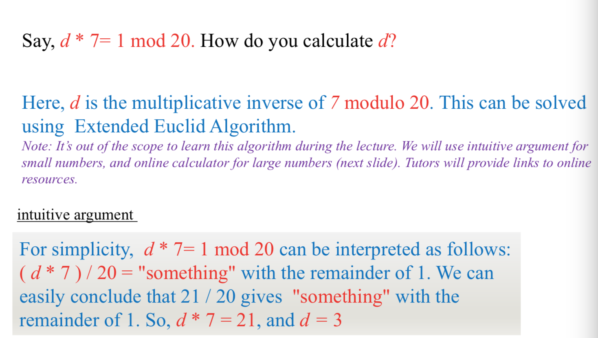
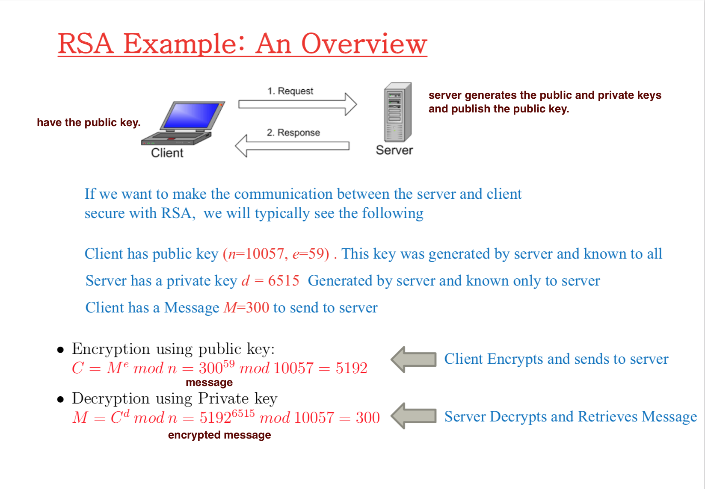
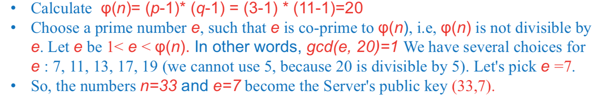
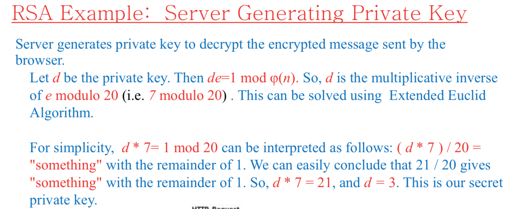

# Lecture 3: Public key 

## Public key (assymmetric key) Cryptography

> Use public key to `encrypt` and private key to `decrypt`


> Receiver generates its `public and private key.`
>
> - Then he saves the private key, `sends the public key to the sender.`

## Some math terms

### Prime numbers

- Any numbers that can be divided evenly **only by 1 or itself.**

### Greatest Common Divisor (GCD)

- The highest common divisor for both **a and b**
- `GCD(12,18) = 6`
- `GCD(12,60) = 12`
- `GCD(12,90) = 6`
- `GCD(3,5) = 1`

```python
math.gcd(a,b);
```


### Co-prime or relatively prime

- Two intergers (a and b) are **coprime ( or relatively prime )** if they share **no common factors.**

- So `GCD(a,b) = 1`

  - **Example**:

    - 6 and 35 are co-prime.

      Since factors of 6: 2,3,6. While factors of 35: 5,7,35. They're not in common.

    - 6 and 27 are not coprime:

      Since factors of 6: 2,3,6. Factors of 27: 3,9,27. They have 3 in common.

### Modular Arithmetric - MOD

Normal mod, get the remainder.

`4%3 = 1`


### Inverse Mod



or can use online calc: https://planetcalc.com/3311/

Python:

```python
from sympy import mod_inverse
mod_inverse(integer, modulo);
mod_inverse(7,20) == 3;
```

### Least Common Multiple (LCM)

- Smallest integer that divisible by both a and b
- **Example:**
  - `LCM(2,3) = 6`. 6 is smallest number that divisible by both 2 and 3.
  - `LCM(6,10) = 30`. 30 is the smallest number that divisible for 6 and 10.
  - `LCM(5,15) = 15`. 15 is divisible for 5 and 15.

## RSA Example: An Overview



### How to calculate n & e

- First, choose two prime numbers:
  - p = 3; q = 11;

- $n = p * q = 3 * 11 = 33$

 

- can choose 3 as well.

  

## How to generate private key



$C = M^emodn = 14^7mod 33 = 20$	

>d is mod_inverse(e,fin)


## To break RSA, you can do Prime Factorization and works back out till find the p,q,fin n, e, d

