# Public key cryptography - Elgamal and Paillier and Practical PKC


# Elgamal

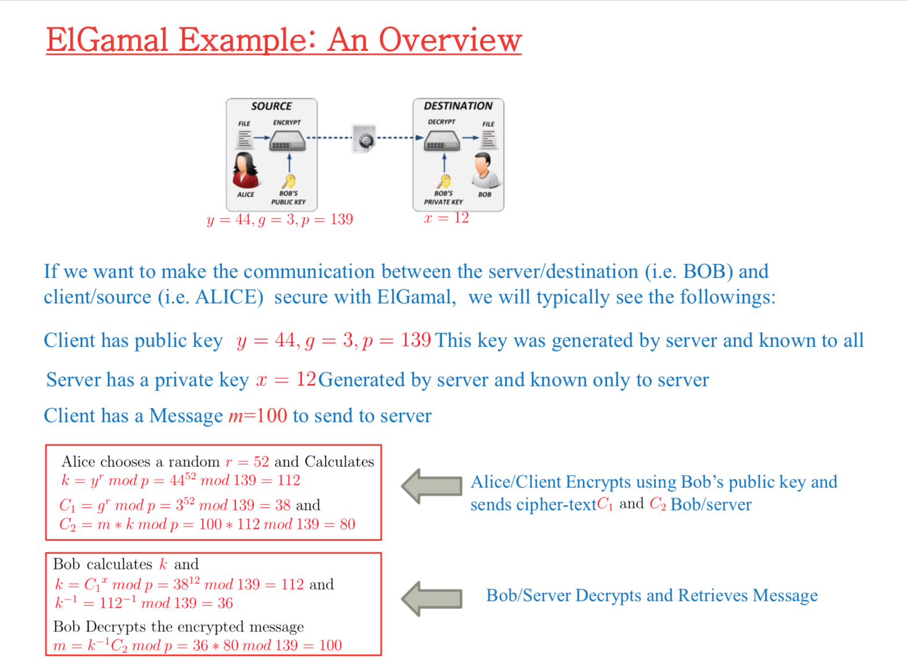

So server side:

- Choose a random number, call it `r`

- Calculate `k` $k = y^rmod (p)$

- Calculate 2 Cipher text, `C1` and `C2`

- $C1 = g^r mod(p)$

- $C2 = m * k mod p$

  `m = message`

Client side:

- if there is no `y`, $y = g^xmod(p)$

- Calculate $k = C1^x mod(p)$
- Calculate mod_inverse(k) = $k^{-1} = k * mod (p)$
- Decrypt: $m = k^{-1} * C_2mod(p)$


### So how do we generate y,g,p,x

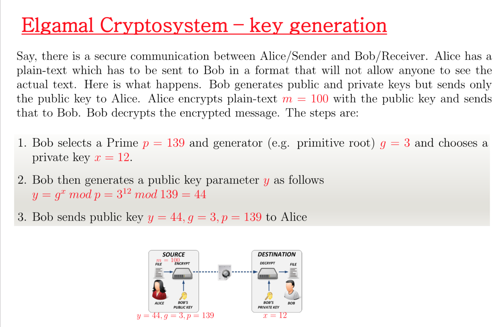

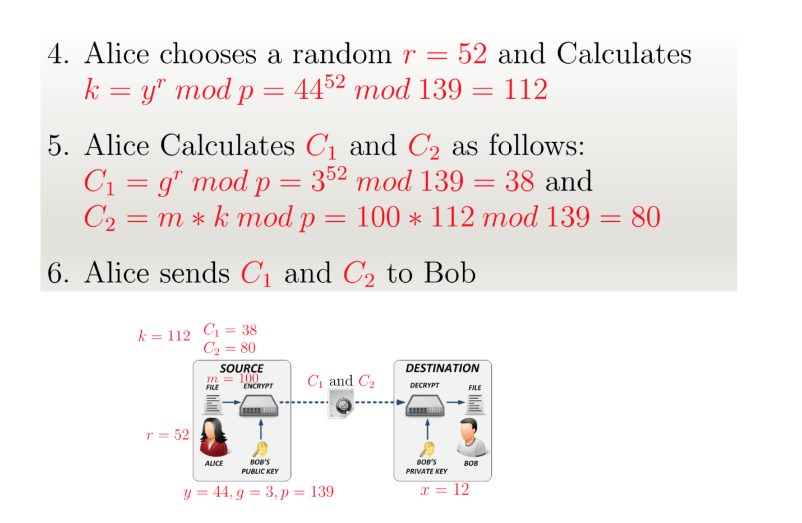

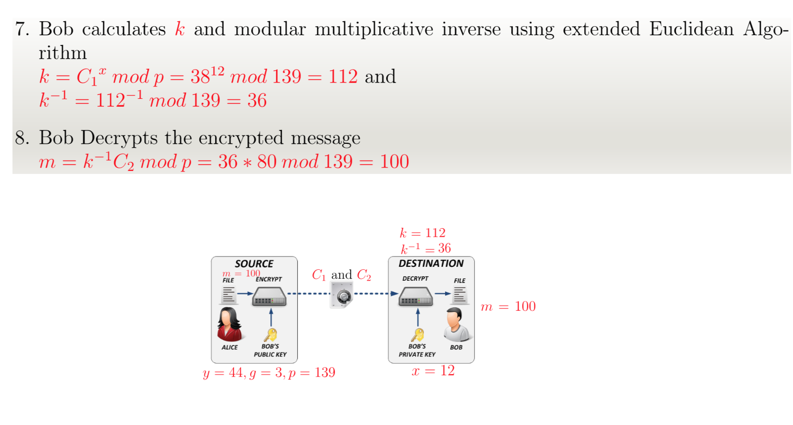

# Exponential Elgamal Cryptosystem

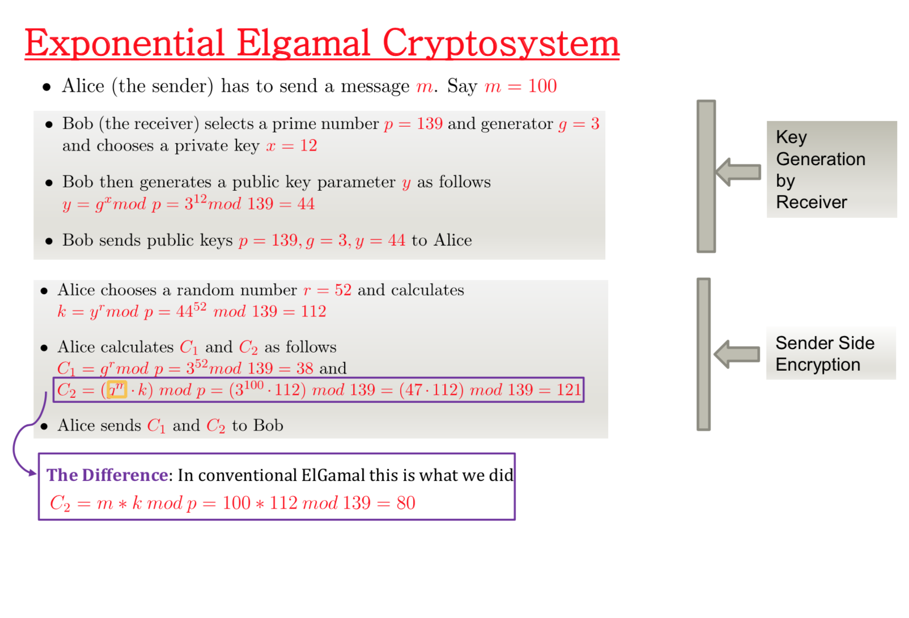

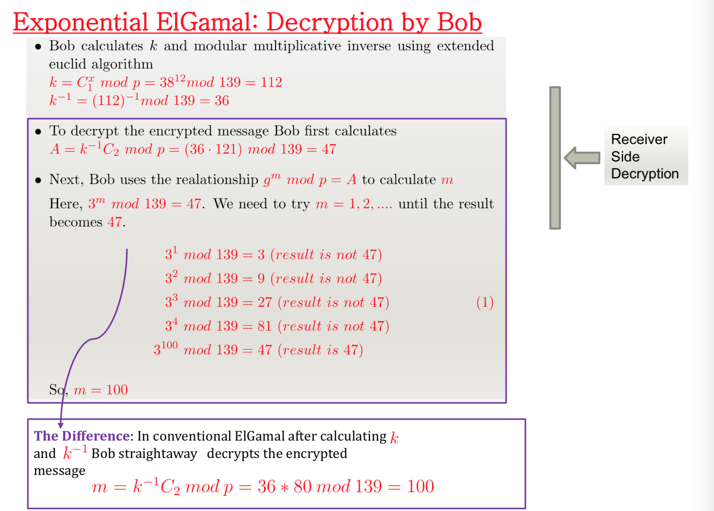


## Limitations of Elgamal

- It becomes double size of the plain text.


# Paillier 

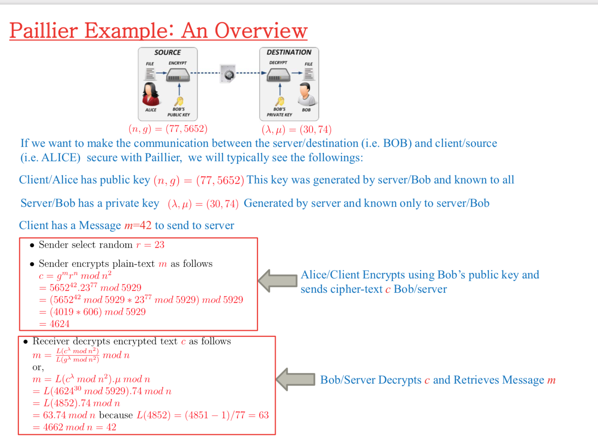

<u>Encryption</u>

$c = g^mr^nmod(n^2)$

<u>Decryption</u>

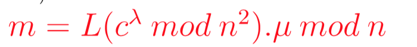

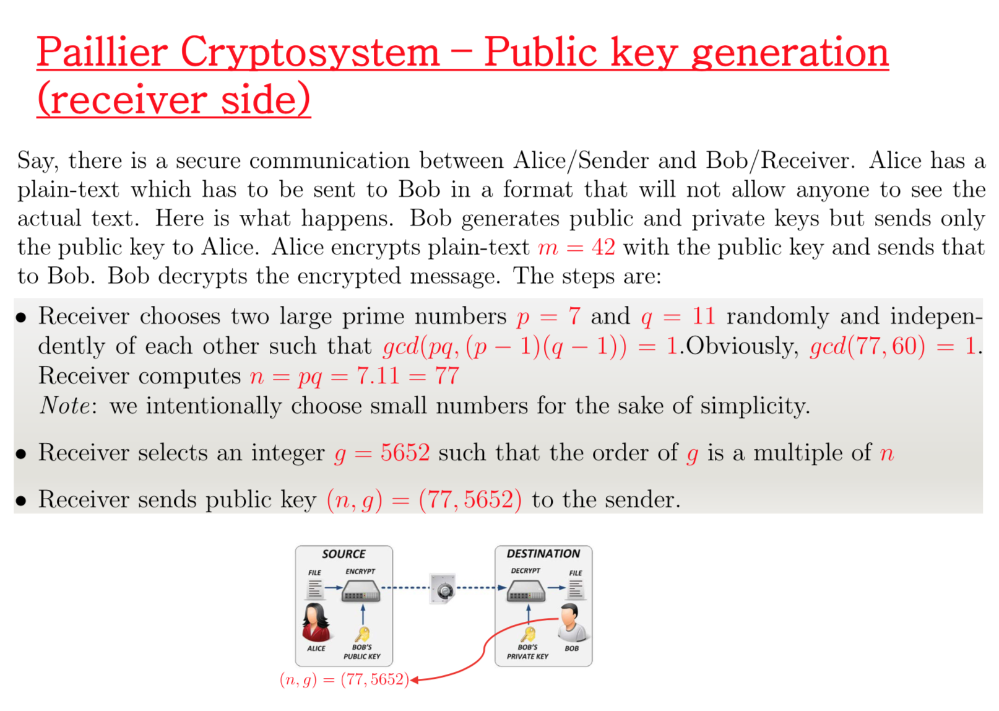

p & q has to satisfy the condition. $gcd(pq,(p-1)(q-1)) == 1$

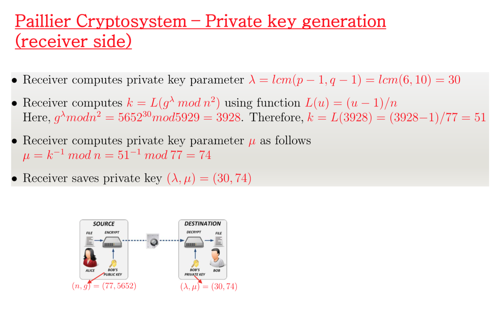

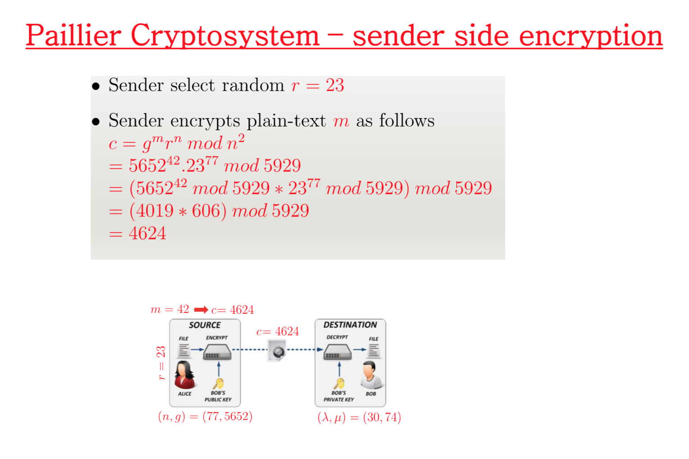

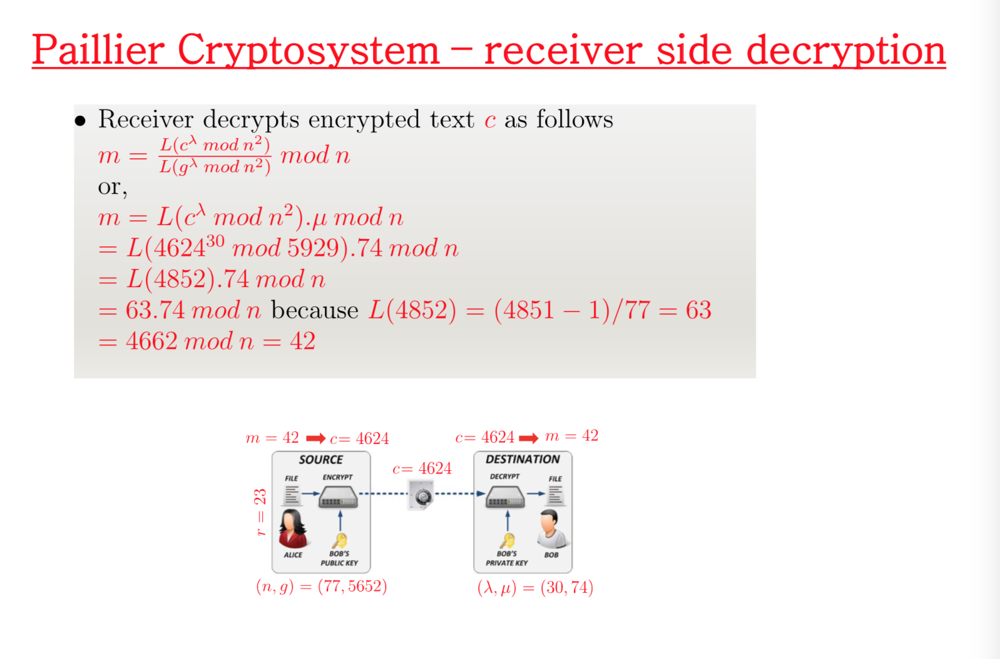

# Open ssl

**Generate private public key:**

```console
openssl genrsa -out key.pem 1024
```

// 1024 bit.

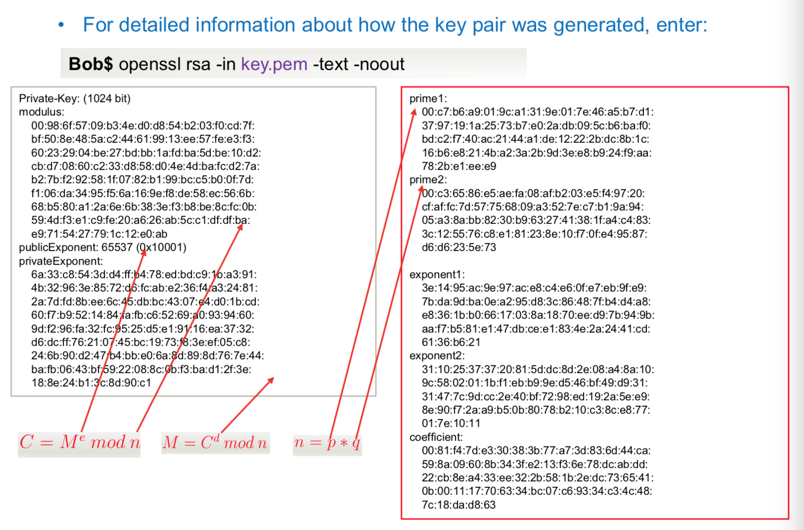

in hex format.

**Generate public key**

```
openssl rsa -in key.pem -out pub-key.pem -pubout
```


**Encrypt**

```
openssl rsautl -in plain-text.txt -out cipher.txt -pubin -inkey pub-key.pem -encrypt
```

**Decrypt**

```
openssl rsautl -in cipher.txt -out result.txt -inkey key.pem -decrypt
```

