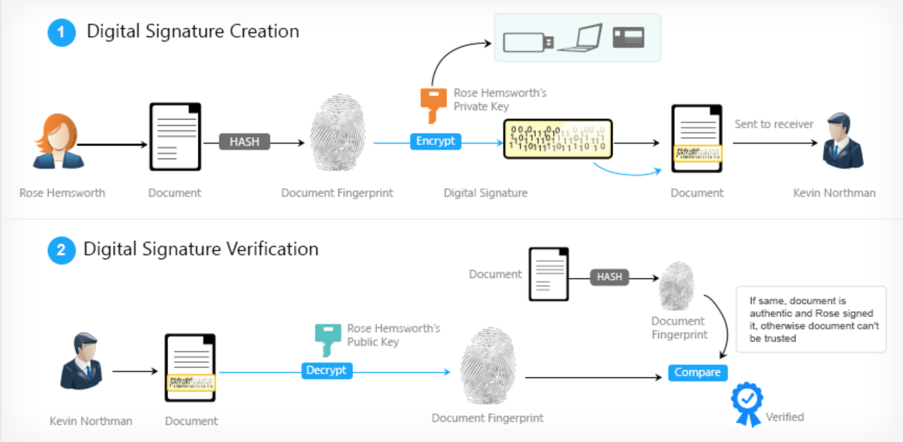
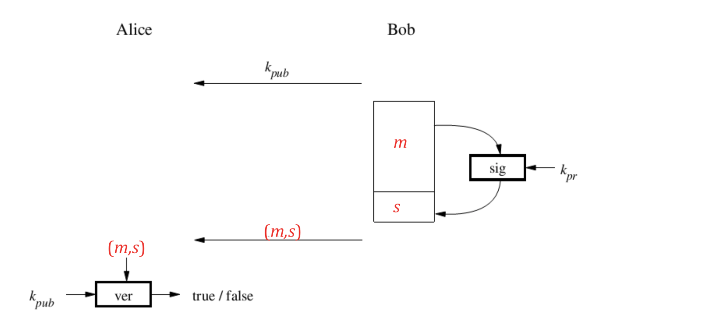
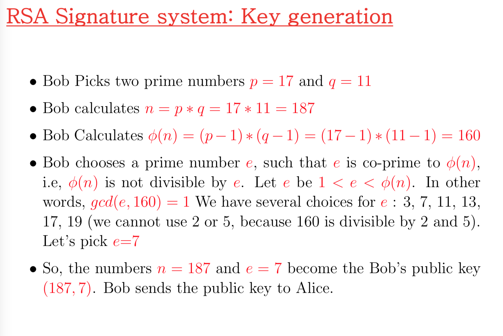
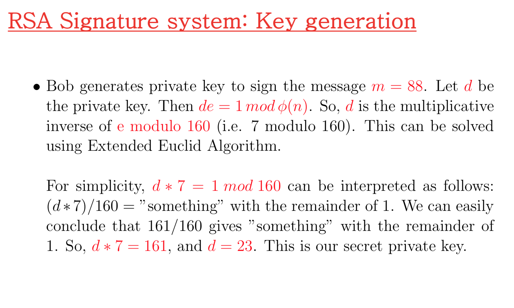
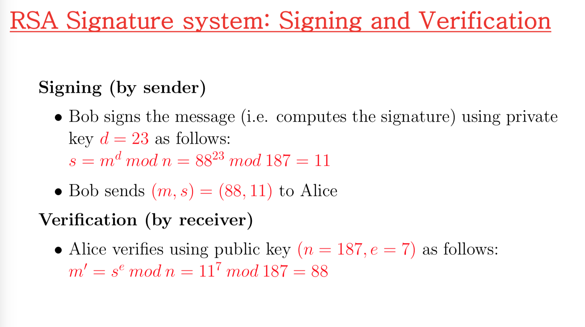
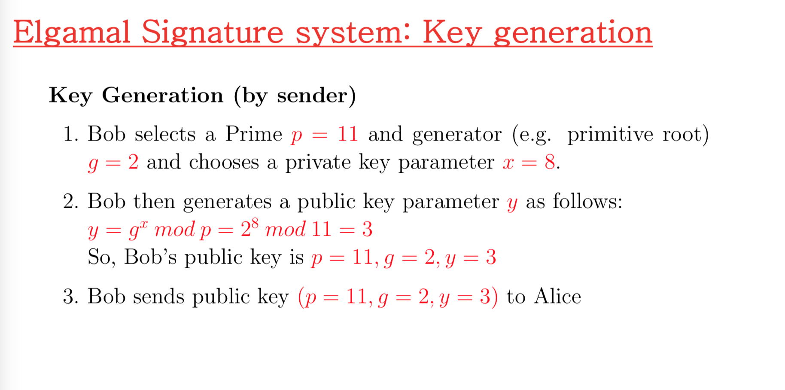
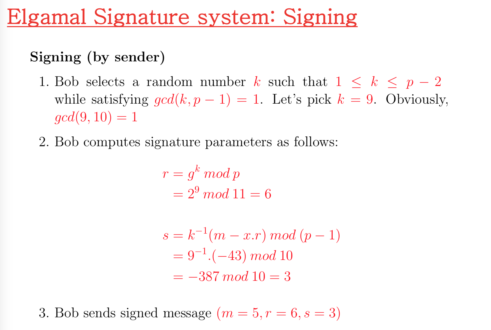
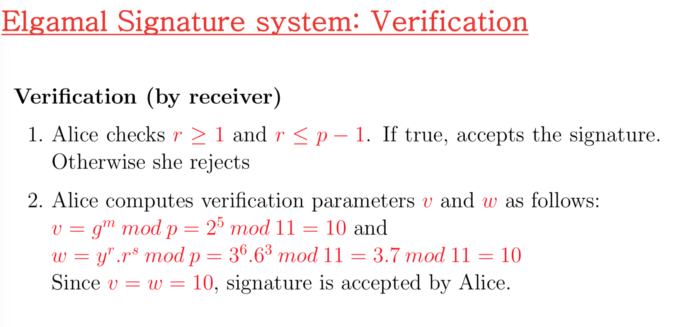

# Digital Signatures

## Digital signature

> To demonstrate the authenticity of a digital message from a trusted source.
>
> Usses bits of data as a key to verify the authenticity of the message in three steps:
>
> - Authentication of sender's identity
> - Confirmation that the sender sent the message in question
> - Verification that the exact message was received. - no alteration in transit.

- Example: fake email address, how do you verify that the content is authentic? 

### Basic idea

- The sender who signs encrypts the message uses a private keyand retrieving party uses the matching public key. 

  

## Principle of digital signatures.



- Bob signing the message $m$
- The signature algorithm is a function of Bob's private key $k_{pr}$
- After signing the message, the signature $s$ is appended to the message $x$ and the pair $(m,s)$ is sent to Alice.

- Alice verifies using that the messager is indeed from Bob by using Bob's public key $k_{pub}$

## RSA Signature System: Steps

> Sender generate public and private key

> Sender signs the document

> Receiver verify the document. 







## Elgamal Signature System: the steps

> Sender generates public + private keys

> Sender signs the document.

> Reiceiver verifies the document.








# Openssl - RSA for Digital Signature

## Applying Public key Cryptography (RSA)

```console
openssl genrsa -out key.pem 1024
```

for detail enter:

```console
openssl rsa -in key.pem -text -noout
```


## Extracting RSA public key

```console
openssl rsa -in key.pem -out pub-key.pem -pubout
```


## Hashing before signing the content

```console
cat test.txt
I love security in computing
```

```console
openssl dgst -md5 -out abc.txt test.txt
```

```console
cat abc.txt
MD5(text.txt) = 13d766f2d057b522de3ba3655b856f78
```

## Sender side Signing with RSA Private key

```console
openssl rsautl -sign -in abc.txt -out sign.out -inkey -key.pem
```

## Receiver side verification with RSA public key

```console
openssl rsautl -verify -in sign.out -out sign.in -inkey pub-key.pem -pubin
```

```
cat sign.in
MD5(test.txt)= 13d766f2d057b522de3ba3655b856f78
```

```
md5 test.txt
MD5(test.txt)= 13d766f2d057b522de3ba3655b856f78
```


# Digital Certificates

- Contains name of user and user's public key
- It is **signed** by the issuer, a **Certificate Authority** such as VeriSign
  - M = (Alice, Alice's public key)
  - S = $[M]_{CA}$
  - Alice's Certificate (M,S)
- Signature on certificate is verified using CA's public key
  - Must verify that M = $(S)_{CA}$

### Notations

**Sign** message M with Alice's **private key:** $[M]_{Alice}$

**Encrypt** message M with Alice's **public key: ** $(M)_{Alice}$

