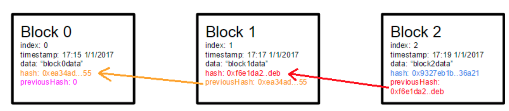
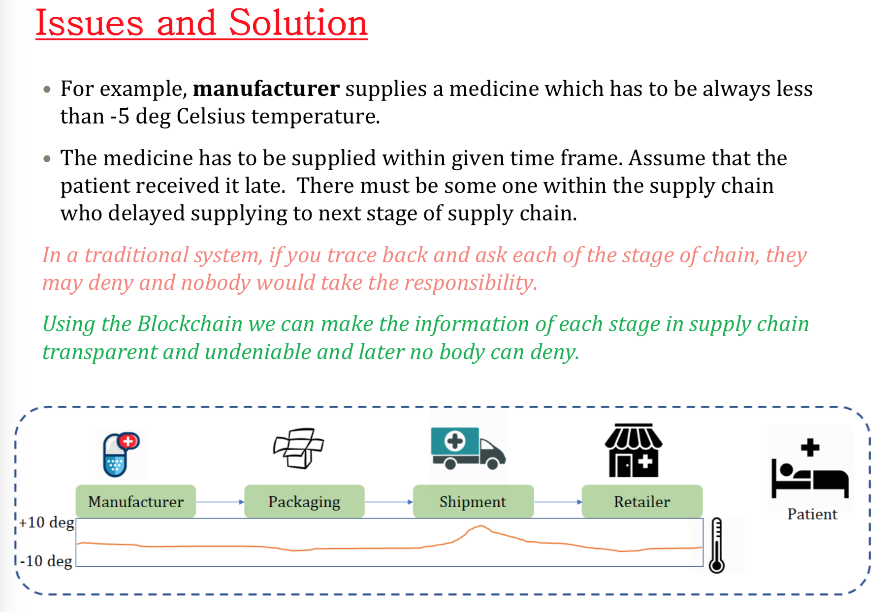
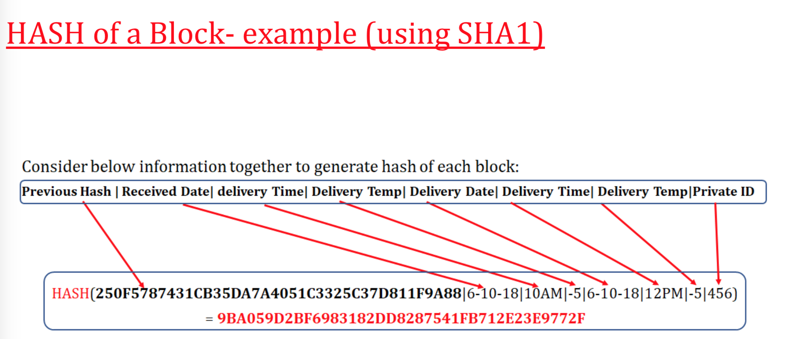
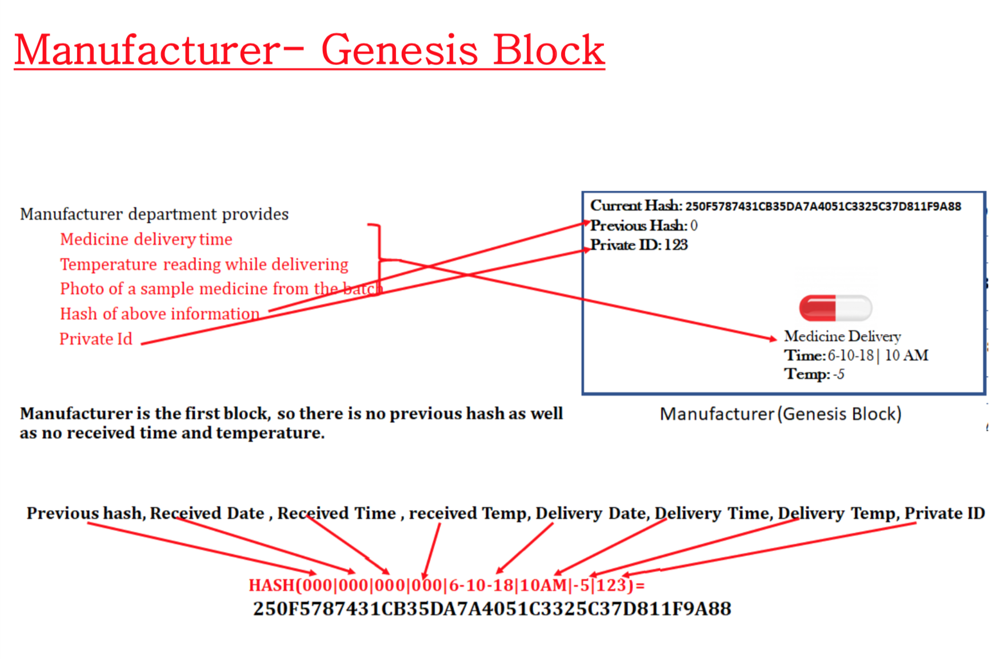
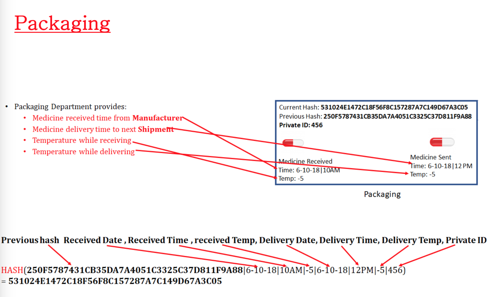
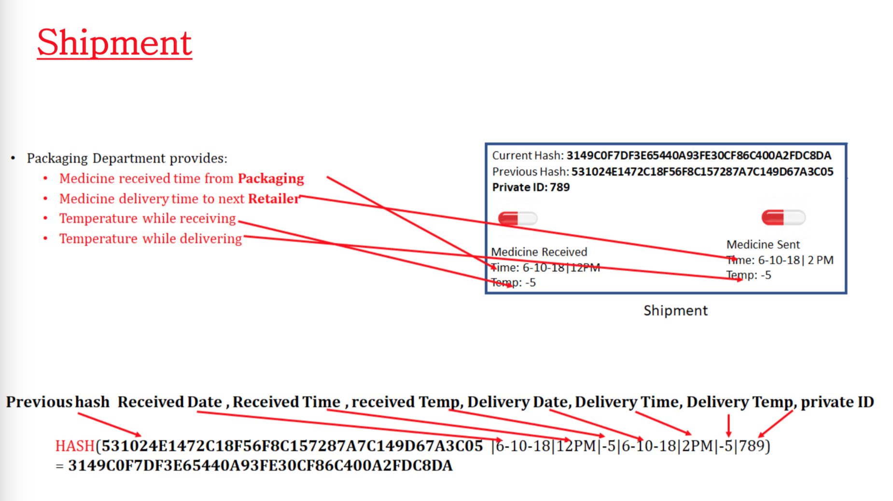
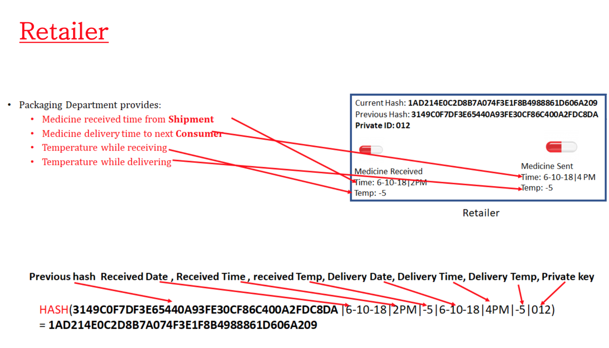
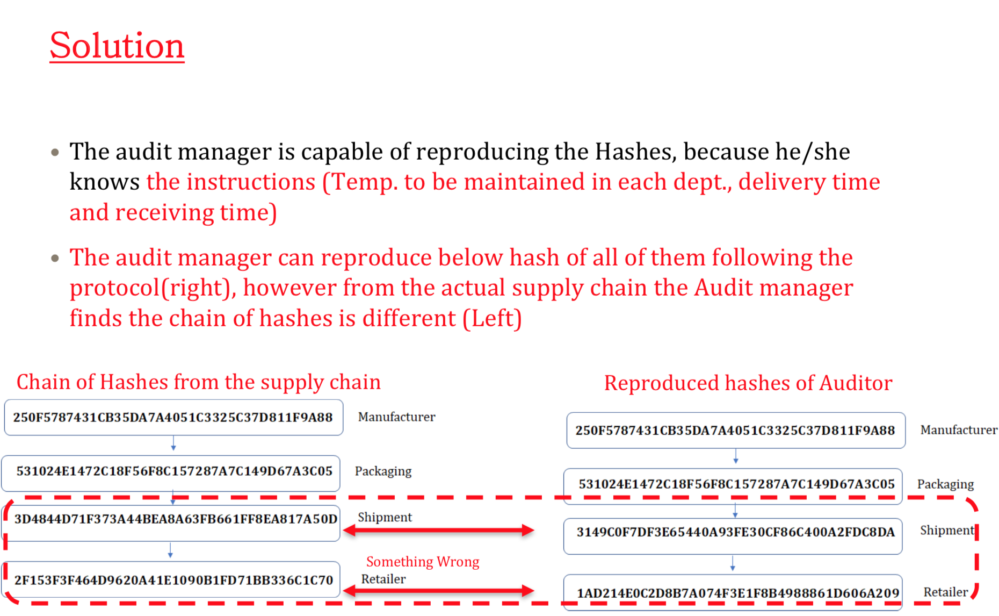
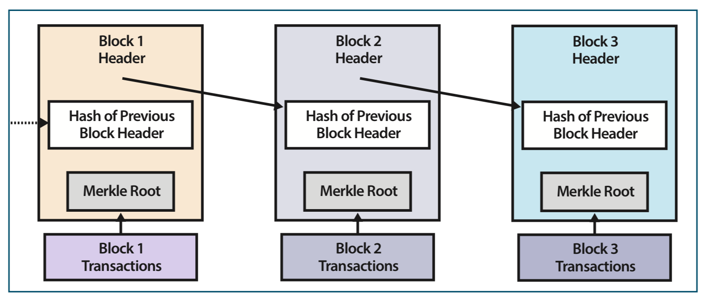

# Blockchain

One block has the hash of the previous block.

**Example:** block n+1 has hash of block n

Everyone must have a same copy.

First block is called `genesis block` since it has no previous hash.

> If you wanna change the value of 1 block, you have to change value of all previous blocks. Which is impossible.

If it's nothing, just put `000`

# Bit coin

**Merkle root** is the top hash function of all the data bit. Read the lecturte slides for more information.