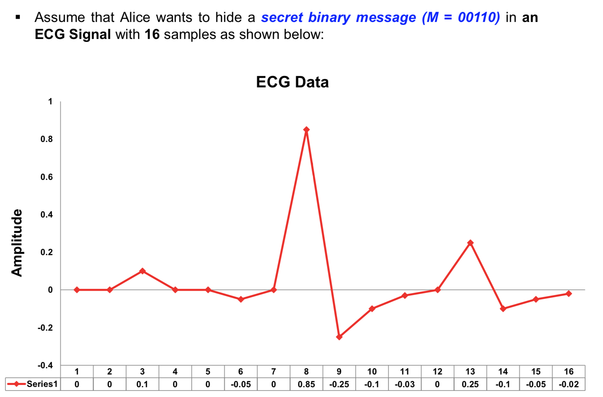
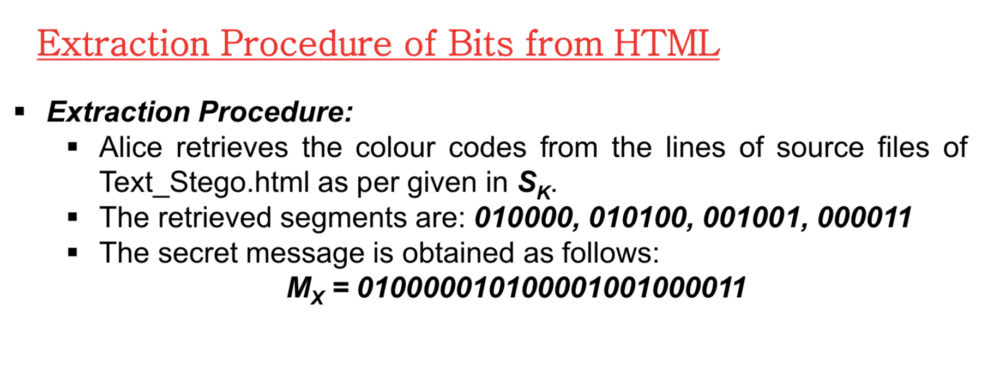

# Lecture 8. Secrete data hiding - steganography

### What is Stegangography?

- Can be defined as hiding technique that is able to embed secret data inside another data host in such way that prevents unauthorized persons accessing the secret message.

#### Different between Stegangraphy and Cryptography
- **Stegangraphy**: hides the existence of the secret message
- **Cryptography*8: provides security with respect to the content of the message

> They all share a common goalm however the way they're used differs significantly.

#### General concept of stegangography

Alice wishing to send a secret message *(m)* to Bob, *"Embeds"* **m** into a **cover-object (C)** using a **stago-key (K)** and obtains a **stego-object (S)**

The **stego-object(S)** is then sent through the public channel and **stego-key(K)** is sent to Bob using a private channel.

- We can hide in Images, ECG, texts, and many other objects
- **Cover-object** and **stego-object** appear to be same but ==**stego-object contains hidden message**==

**Cover-object (C):** refers to the object used as the carrier to embed messages into. Generally, less important in the communication.

**Stego-object(S):** refers to the object which is carrying a ==hidden message==. So given a **cover object** and a message. The goal of steganographer is to produce a **stego object** which would carry the message.

**Stego-key (K):** refers to the secret information (secret key) that will be used to extract secret message.

**Embedding Function (Em):** refers to the algorithm used by **sender** to hide secret message into the cover-object and produce the stego-object

**Extraction Function (Ex):** refers to the algorithm used by the **receiver** to extract secret message from the stego-object.

# Steganography Example-1 Secret Data Hiding in Numbers

Assume that Alice wants to hide **M = 101** in an interger number **14526**

Here, length of the secret message is 3. And `cover data = {14526}`

**Embedding procedure**

- The number in cover data is converted to **16-bit binary string**

  - `0011100010111110`

- Alice will hide each bit of the secret message in **randomly selected locations** of the binary strings

- Let, randomly select **6,11,15** of

  

- Therefore stego-key becomes

  $S_k = <locations> = <(6,11,15)>$

 **Extraction procedure**

# Hide in ECG data

# Image steganography

Images use 24 bits color RGB

(8 bits for red, 8 bits for green, 8 for blue)

# Hiding in texts

