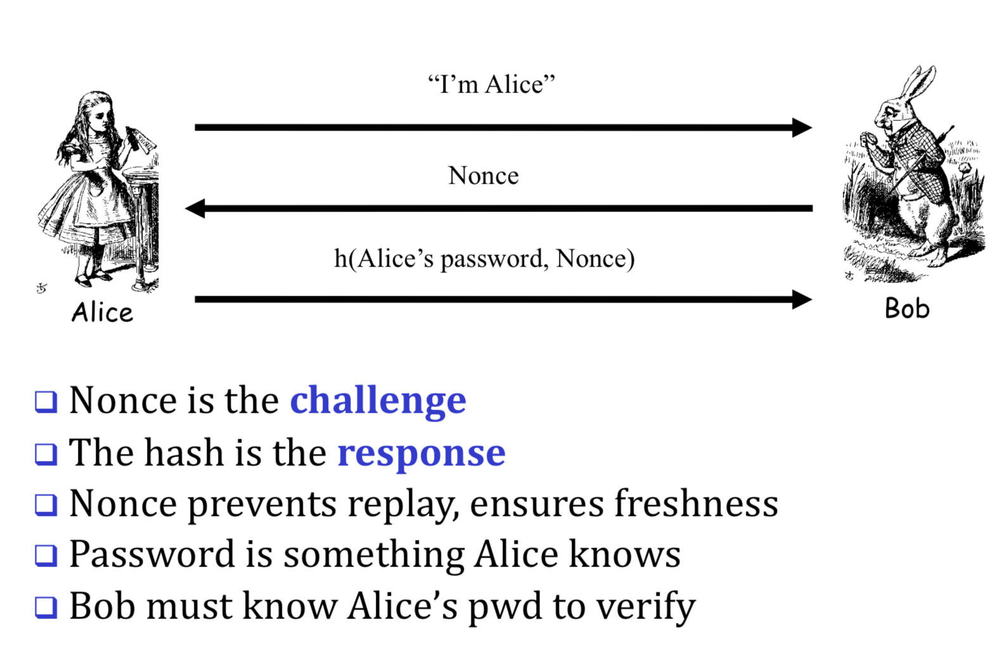
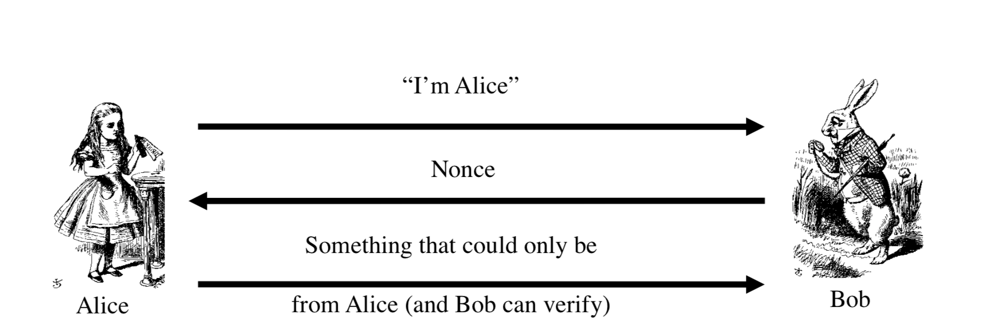
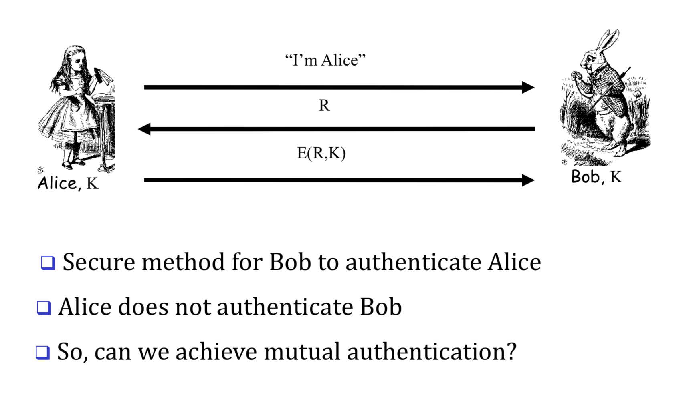
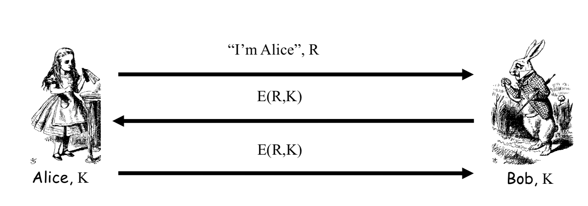
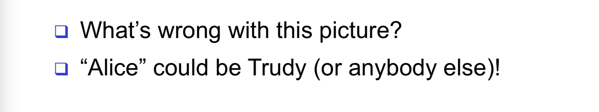
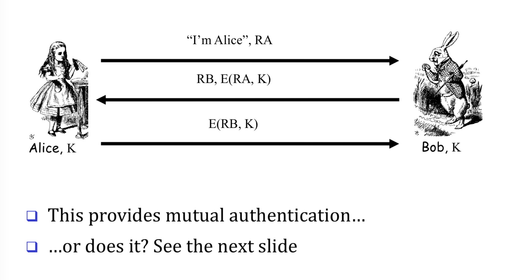

# Digital Authentication & Security Prototcols

Two access controls, you need:

- **Authentication**:
  - Are you who you say you are?

- **Authorization**
  - Are you allowed to do that?

## Protocols

- Networking protocoles - rules followed in netowrked communication systems
  - Examples: HTTP, FTP, etc

- Security protocol - the (communication) rules followed in a security application
  - Examples: SSL, IPSec, Kerberos, etc.

>  Protocols still have flaws.

## Authentication

Simply passwords, fingerprints, etc.

### Challenge-Response

Challenge so that fake is not possible.

And only Alice can provide the correct response.

- **Nonce** (**n**umber used **once**)

### Generic Challenge-Response

### Symmetric key notation

Encrypt plaintext **P** with key **K**

$C = E(P,K)$

Decrypt cipher text **C** with **K**

$P = D(C,K)$

Alice and Bob share symmetric key K.

K known only to Alice and Bob

## Authentication with symmetric key notation

R is nonce, challenge.

# Mutual authentication

RA and RB are nonces