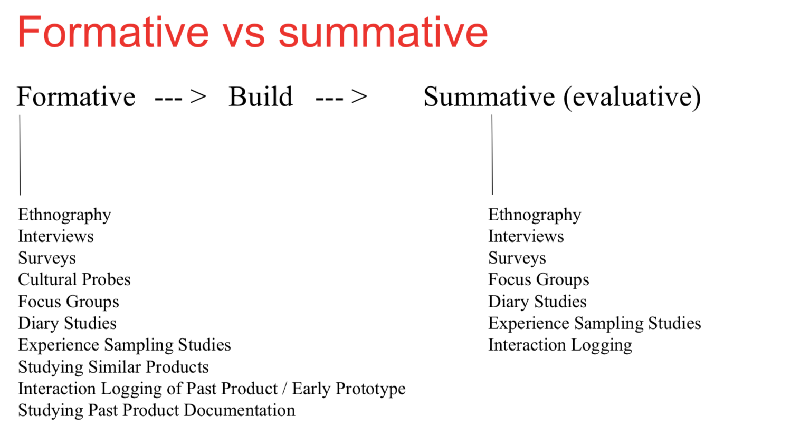
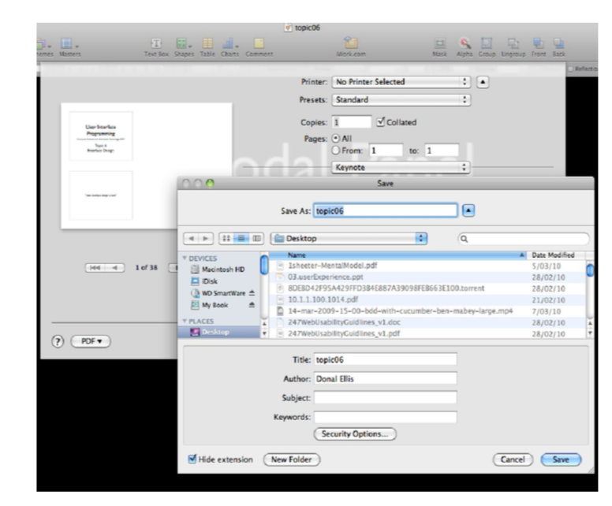

## Nielsen's components of usability

**Learnability**: How easy for the users to use it

**Efficiency:** How quickly they can peroform the task.

**Memorability:** When users return the design after a period of not using it. How easily can they re-establish proficiency.

**Errors**: How many errors do users make. How severe are these error and how easily can they recover the errors

**Satisfaction:** How pleasant is it to use the design.

## Nielson's 10 Heuristic

1. Visibility of system status
   - The system should always keep users informed what is going on in the background.
2. Match between system and the real world
   - The system should speak the user's language, phases and concepts should be user familiar than system-oriented terms.
   - **Example:** `404 notfound` should be replaced with `The page you're looking for is not found`
3. User control and freedom
   - Users often make mistakes when using the system. The system should have emergency exit, something like undo or go back so the users can control.
4. Consistency and standard
   - Use the same words for the same thing
   - **Example:** choosing either `exit`, `log out` or `leave`
   - Remain the same navigation UI model.
5. Error prevention
   - User friendly error messages are good but it's better to prevent the error before users even make it. 
   - One way is to make a confirmation button so users have to commit to the action
6. Recognition rather than recall
   - User should not have to memorise the functions of the app.
   - Use layouts, graphic design so the user can interact with the graphic easily.
7. Flexibility and Efficiency of use
   - Allow expert users to use shortcuts
   - Scaling functionality depending on user's skills.
8. Aesthetic and minimalist design
   - Dialogues should not contain information which is irrelevant or rarely needed.
   - Try to make things simple
9. Recognize, diagnose and recover
   - Error messages should be clear and natural, precise, not intimidate or blame the user
   - Good error messages help user to solve thier problem, learn more about the system
   - **Example:** Google: "did you mean to search ..."
10. Help and documentation
    - It's better to make the user get used to the system but however help and documentation is still neccessary
    - The document has to contain the information that users need and don't contain any extra information.

## Design principle

- Heuristics are commonly applied on an existing system or prototype.
- Design principles are used to analyse the system interface and information architecture.
- These are **guidelines, not rules**

> ### Principle of proximity
>
> - Buttons that in the same group of function should be together.
> - **Example:** "Yes" would be highly expected to next to "No"
>
> #### Visibility and visual feedback
>
> - Prominence
>   - Putting the more important items larger than the less important one. So users will focus on the important items first.
> - Opacity
>   - Chagne the opacity to bring items into focus
> - Typeface
>   - The font must be clear to increase readability 
> - Colour and contrast
>   - Higher contrast or brighter colours will draw more attention

>### Affordance
>
>- Make things easier to do intuitively
>- Make things harder to do it wrong
>- **Example: ** The three prong electrical plug is harder to do it wrong.

> ### Status
>
> - Always indicate the background task or system status to the user. Either it's processing or wating for user's input
> - Like Heuristic 1 - Visibility of system status

> ### Consistency
>
> - Keep everything consistent in terms of interaction placement, colours and type of interface.
> - Do not keep switching your navigation bar.

## Design Laws

> - **Hick's law:**
>   - The more choices, the more complicated
> - **Fitt's law**
>   - It's faster to hit larger target which closer to you than smaller targets further than you.

## Survey

- Coverage error:

  - How to get everyone using your System.

- Sampling error:

  - If you only talk to a sample.

- Nonresponse error:

  - Survey correct people but not all of them answer

- measurement error:

  - People don't answer correctly.
  - Ask factual questions people often answer themselves?
    - No problem
  - Ask questions people need to think about?
    - The way you ask the question could influence the answer.
  - Social desirability (answer so as to be viewed favourably)
    - Self administered
    - Interviewer
  - Acquiescence (bend to the ‘view' of question)

## Formative usability testing vs Summative usability testing

### Formative

- Use at the start of the design
- Testing with paper-prototypes and similar
- To discover the design orientation.

### Summative usability testing

- More like a quality assurance testing
- User at latter half of the development phase.
- Testing with actual working prototypes
- Do this to determine metrics and then compare with the result of the improved version.
- There will be users to test the product before it released.

# 3D method

- Attitudinal vs Behavioral
- Qualitative vs Quantitative
- Context of use.

# Ethnography method

- Fly on the wall
- A day in life
- Shadowing
- Personal inventory

**3 main principles**:

- Holistic - Look at the thing boardly
- Natural setting - Directly look at what you're studying
- Descriptive - Focus on recording behavior

# Survey

Opened end question:

- Leave blank for users to fill in.

Closed end question:

- There are selections user can choose.

Rules:

- Start with screener
- Don't lead user
- Don't make them feel like being tested
- Don't waste time.

# Type of user

- Information overloader: 
  - Eager to tell you everthing even if it's not relevent
  - **Solution:** sift through the noise
- The control freak
  - very **pedantic (excessively concern with minimal details)** about controls, also try to run the test
  - Create their own questions
- The Devil's Advocate
  - Find problems whenever they could
  - Need to see if the problems they mention are actual problems.

# Context scenarios

- Narrative (kể chuyện)
- Describe the contexts and settings of the application.
- Tell a store about how the personas use the application to solve the problem.

# Function and data needs

What are the function and data that the app needs.

# Key-path scenarios:

| Scenario Step                              | User experience requirement                                  |
| ------------------------------------------ | ------------------------------------------------------------ |
| User open the app and see the login screen | Create new account or login using face                       |
| User adds a task                           | Add a new task with a successful message.                    |
| User views task                            | a list of task appears, user have the options to delete the task and undo the action. |
| User checks task complete                  | The relevant task will be crossed and marked as completed    |
| User quits the app                         | Everything is saved                                          |

## Form factor

What type of device are you designing for?

IOS, IPHONE 5S - 640x1136...

## Posture

How it feels to the user. 

Casual, professional, transient looking app?

# Input method:

Voice, keyboard,...

# Functional element:

things like buttons.

# Fidelity

**Low**:

- more like sketch

**High**:

- Similar finished product

# Horizontal vs Vertical Prototype

**Horizontal**:

- Focus on feature

**Verticle**:

- Focus on detail.

# Prototype

- Paper prototype
- Video prototype
- Digital prototype (invision, XD)
- StoryBoard

# Workflow

Creating diagrams for task

**Mind map**

**Information architecture**

**Card Sorting**

# Usability Studies

- It's user testing.
- Observe user uses the app.
- To measure the effectiveness of a feature set within your application

# Components of a test

- Test plan
- Screener (try avoid bias)
- Script (keep it structure)
- Test Resources
  - Location:
    - Quiet, good lighting
    - one-way or double-pane mirror
  - Equipment
    - event-logging software
    - digital audio/video capture
  - People 
    - Task
- Post test survey
  - Open ended question can be used to gan further insights

# Conducting the test.

- Each person a paper of task/scenerio
- Be polite, friendly but firm
- Encourage the tester to think aloud.
- Ensure the testers feel comfortable voicing out their hatred for your interface.
  - Ask them politely why.
- Don't guide the user through the task
- Not an opportunity to show off your shiny program but get your program shiny
- Tester asks you if that is the right way to complete the task?
  - Reply in the form of another question asking why they think that is so.

- Tester encounters a problem
  - Ask why
- Time each attempt at a task

# Guerrilla user testing

- Go to cafes and public space and ask them to test for a couple minutes

**When to use**

- When you don't have a particular target
- When you want to gather first-impressions and see if people understand your product's value.

# Controlled experiment: A/B testing

Give 2 solutions and ask them which one they prefer, think it's better.

# flow

is the using flow, inturruptions will disrupt the flow, like alert pop up.

# Excise

The effort that is required for users to do a task.

# Design pattern

## Chunking content patterns

#### Titled sections

- 

- 

#### Card stack

- 

- 

#### Closable panels

- 

- 

#### Movable panels

- we 

#### Collapsible panels, tabbed panels, accordion

    - http://lrrpublic.cli.det.nsw.edu.au/lrrSecure/Sites/LRRView/10378/applets/spry/collapsiblePanels.html

## Visual flow patterns
#### Left right alignment

#### Diagonal Balance

## Dynamic layout patterns
#### Responsive disclosure

When pressing an item, the other option show up

#### Responsive enabling

Everything is there but disabled, have to check a button to enable

# Page layout

**Visual Hierarchy**

- More important => More prominent
  - Whitespace
  - Contrast fonts
  - Contrast foreground, back ground
  - Graphics
  - Spatial (space) positioning

**Visual Flow**

Designed to make user's eyes to follow in the correct order.

**Grouping and Alignment**

- Group together related element
- Alignment
  - Vertically or horizontally

**Page layout patterns**

- Visual framework
  - What:  Keep the same UI within multiple pages but flexible enough to handle different content
  - When: a website with multiple pages or UI with multiple windows
  - Why: for user to be familiar with navigating
- Centre stage
  - What: The task user needs to complete put into a largest area tools on the side.
  - When: a page to perform a specific task, other content is secondary
  - Why: Guides user to the most important information on the page.

## Navigation patterns

**Global navigation**

- Use small part of the interface to show a consistent link or buttons on each screen

**Pyramid**

- Use the next and previous link to get to next and previous slide
- Used for slideshow

**Module panel**

**Sequence map**

process map

**Breadcrumbs**

**Colour-coded sections**

**Hub and spoke**

Everything can be accessed via a hub.

## Abtract content patterns

## Physical layout

# Mobile design advantages

- Instant on - users need interface to be very responsive and remember state
- GPS
- Camera
- Integrated - gather information from a range of linked service
- Easy install of apps - customize easy
- Motion, tilt Sensors - can be used as input device

# Mobile design contraints

- limited pixel real estate
- Touch screens
- Variable screen widths
  - have to do responsive
- Touch screen
  - fat finger problem
- text insertion difficulty
- physical environments
  - users get distracted by the environment.But have to make sure that they're still able to use your application.
- usage behavior
  - users are expected to be able to continue what they are doing after being interupted.
  - they also expected to be able to switch between different application quickly.

# Mobile pattern

**One-window drilldown**

**Example patterns**

- Verticle stack

  - 

- Filmstrip

  - Like carousel pattern, can swipe
  - 

- Touch tools

  - Show tool when a touch pressed
  - **Example:** video player
  - 

- Bottom navigation

  - 

- Sidebar navigation

  - 

- Thumbnail and Text List.

  - 

- List buttons

  - 
  - The entire list is buttons.

- Infinite list

  - 

**Pull down action**

**Generous borders**

- Make target large enough for clumsy button by putting large margins and white-space around the button.

**Text clear button**

- Press X to clear the whole input.

  - 
