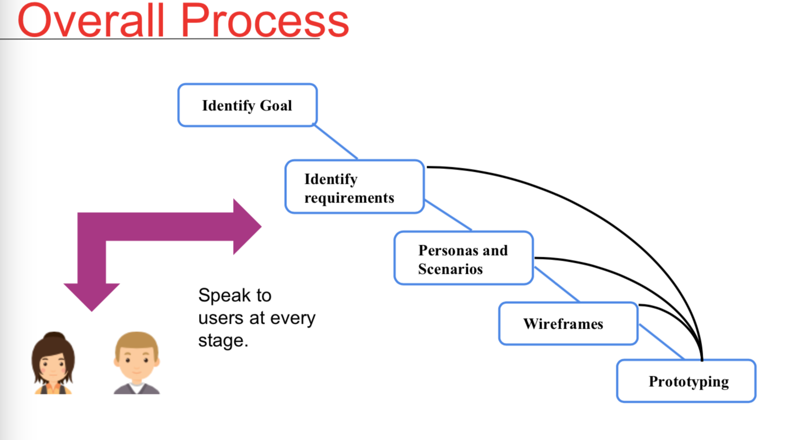

# Lecture 1: Usability sudies

## Usability

> How the product is used by the users. What's the initial goal. What's the product for?

**Usability is the out come of UCD - user center design**

A good Usability has 3 features:

- Engage [how to use me]
- Enable [how to use me to achieve your task]
- Empower [how well do you understand my role in achieving your role]

## Nielsen's components of usability

**Learnability**: How easy for the users to use it

**Efficiency:** How quickly they can peroform the task.

**Memorability:** When users return the design after a period of not using it. How easily can they re-establish proficiency.

**Errors**: How many errors do users make. How severe are these error and how easily can they recover the errors

**Satisfaction:** How pleasant is it to use the design.

## Steve Krug's atributes of usability

**Useful**: Does it do something that people need done?

**Learnable**: Can people figure out how to use it?

**Memorable:** Do they have to relearn it each time they use it?

**Effective:** Does it get the job done?

**Efficient:** Does it do with a reasonable amount of time and effort?

**Desirable:** Do people want it?

**Delightful:** Is using it enjoyable?

**UX (user experience) is one of the focuses of UCD. ** ~ UCD

**HCI (human-computer interaction) focuses on humans interacting with computing products.**

**UCD (user centered design) is a methodology(method) to ensure they're creating products that meet users' needs.**

## Overall process of UCD

> You don't build products, you build **experiences**. By understanding user's needs and the tech and design requirements to meet those needs.

# Users

> They do not care about technical details
>
> Most users sometimes does not know what they want

### User centred Design

- Is a method/process to improve usability
- To remove as much guess work as possible
- To work from the perspective of the user whenever it is relevant to do so.

## What is it not?

- not only a reactive process