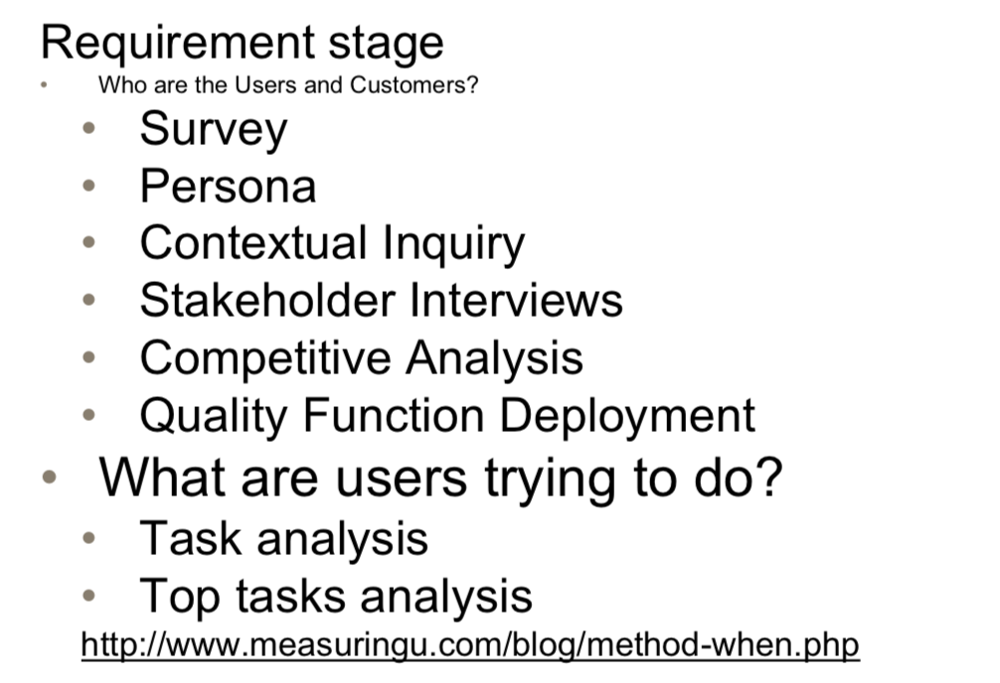

# Lecture 2

## Defining User

- User: anyone that will be gaining value from your product

**Identifying users**

- Who are the user groups?
- How to classify them? By type of business, value, tasks, .. ?

## User characteristic

- Age
- Gender
- Ethnicity
- Others.
  - Skills: What sort of skills require when interacting with your product.
    - **Example:** If you design a website, your user should have basic knowledge to use a web browser (like play a video, drop down menu...)
  - Domain experience: background experience.

## Finding User

- Questionnaires
- Interviews
- Observation
- Competitive evaluation
  - Identify product
  - Ascertain users
  - Get access to them

**Why ?**

> Because that's what UCD about, we need to get users involved from the start.

#  

# Identifying and Defining task

### Indentify

**Precondition:** Information or substeps you need to know. 

**Example: designing an email software**

`precondition`: User have to log in to send the email

`subtask:` User have to put in the receiver email address.

You should think about all the tasks that users should complete.

### Define

- How is the task learned
- How would a fresh user understand your design ?
- Is it intuitive? …

## User Research Methods

### 3-dimensional framework

- Attitudinal vvs. Behavioral
- Qualitative (formative) vs. quantivative (summative)
- Context of Use.

## Survey

- Coverage error:
  - How to get everyone using your System.
- Sampling error:
  - If you only talk to a sample.
- Nonresponse error:
  - Survey correct people but not all of them answer
- measurement error:
  - People don't answer correctly.
  - Ask factual questions people often answer themselves?
    - No problem
  - Ask questions people need to think about?
    - The way you ask the question could influence the answer.
  - Social desirability (answer so as to be viewed favourably)
    - Self administered
    - Interviewer
  - Acquiescence (bend to the ‘view' of question)

#### Recommendations

- Multiple-choice over free text.
- Example of useful questions:
- http://www.uxforthemasses.com/online-survey-questions 

#### The likert Scale

- The scale which has `strongly agree` `agree` `neither agree nor disagree` `disagree` `strongly disagree`

## Interviews

> When you want more details.
>
> Able to pick up body languge.
>
> Able to get deeper if encountered an interesting response.

**Types of interview**

- Formal/structured interviews
  - Directed approach, when you know exactly what you would like to uncover
  - Has specific questions.
  - Can be quicker, avoid deviations.
- Informal/unstructure interviews
  - Ideal when you're still exploring the problem space
  - You can change and alter questions on the fly
  - Good idea when you have no clear directions as what to ask
  - Have a conversation with the user
- Contextual inquiries.
  - Main difference from previous two is that you engage the users in their environment where they are using your product.
  - Especially important for applications in static envoronments
  - Even if your product is a mobile application for example, it would be actually be beneficial to interview them when they are most liable to use it, i.e on the streets or in a tram.

# Ethics in user tests

- Pressures on user
  - anxiety
  - feels like intelligence test
  - comparing self with other participants
  - feeling stupid in front of observers
  - competing with other participants.