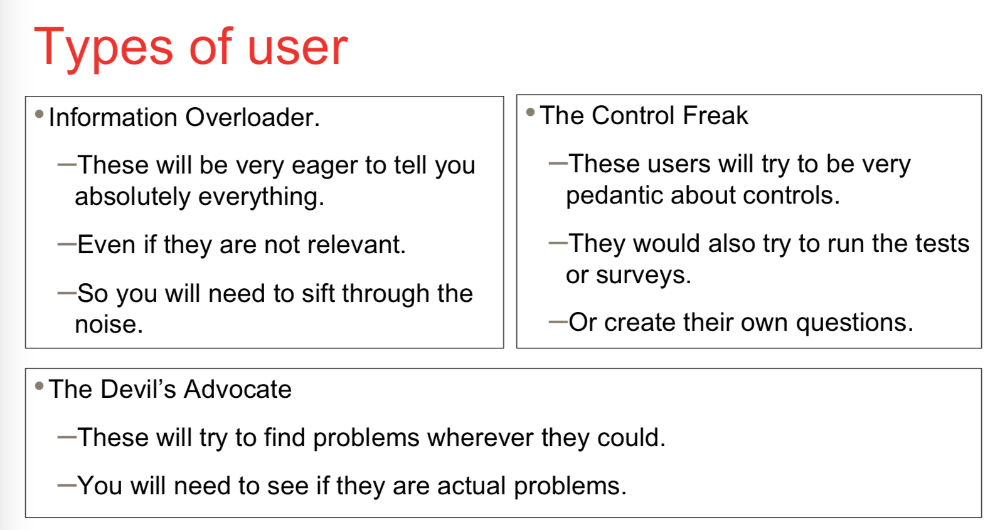
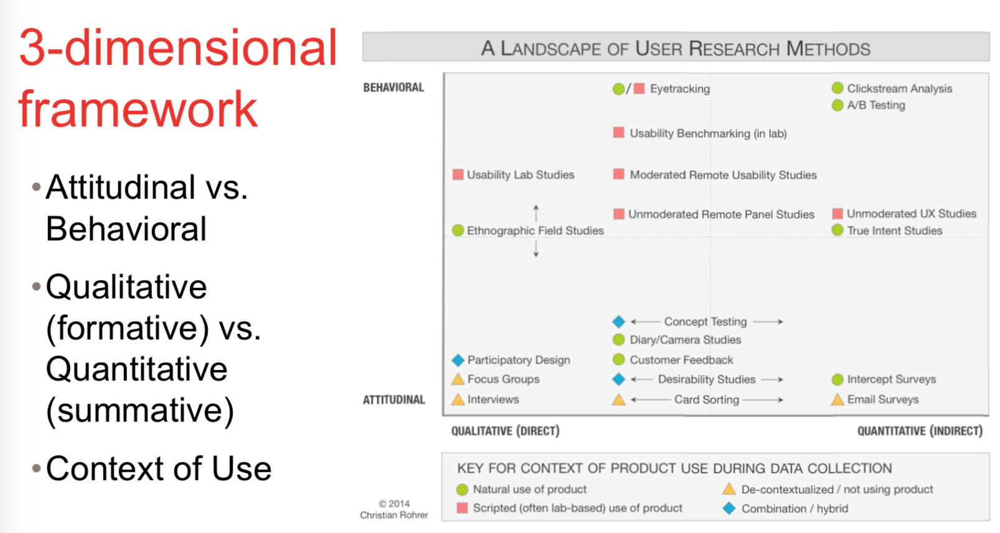
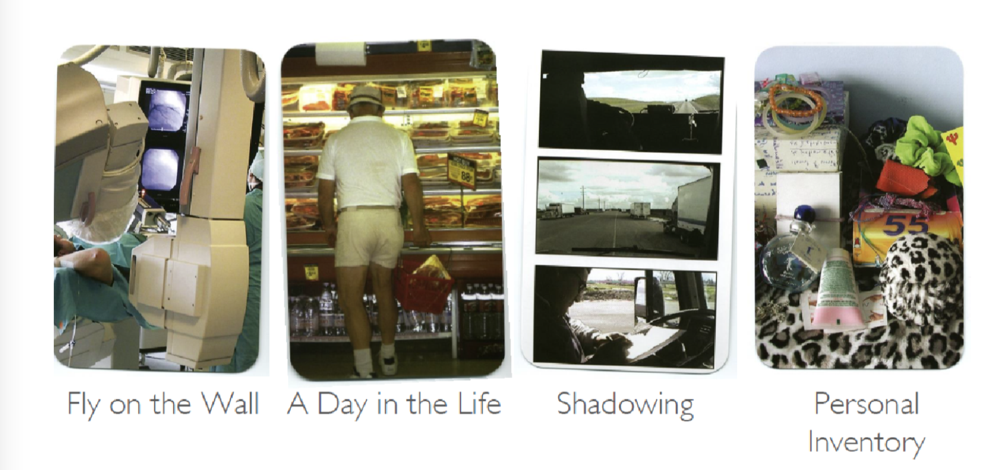

# setting up for feed back

# User reasearch methods

## Formative vs summative

- formattive: testing at the start of the design phase, testing with paper-prototypes or similar.
  - To discover insights and shape of the design direction.
- Summartive: testing during later half of the development phase. Testing with actual works prototype.
  - To determine metrics.

# Observations

- We can't ask users twhat they want, what they say is different than what they do.
  - => Watch what people do.

## Ethnography (culture)

- Develop by observing what people do. Like developing a car park, ethnographist will look at what people do, how people read the sign.
- Today ethnography is**applied to the study of people and social groups**.

## 3 principles of ethnography

- Holistic: tiny details into big picture context, attempt to look at thing broadly - understand the context
- Natural settings: observe in the things that you're trying to study
- Descriptive: focus on recording behavior.

- Record how people use the interface by recording video.

# How to stalk people

- Fly on the wall : Walk from far away
- A day in the life: trailing them to see what they do for the whole day
- Shadowing: like a day in the life but more active
- Personal Inventory: look at their inventory too see what group of people they're in.

## Diary Study

- users are requested to record feedback and/or events on a specific part of a product experience.
- usually lasts a week or 2.

<u>Advantages</u>

- Rich data, covers responses over time.
- Context rich data, user experience may be related to external and internal aspects.

<u>Disadvantages</u>

- Resource intensive - time/$$
- Self reporting bias.
- Highly reliant on user participation.

## Focus Group

- Can do before summative and formative.
- Bring together 6-9 users to discuss issues and concerns about the features of a user interface.
- Example questions
- 

## Surveys

- Types of questions
  - Open ended questions:
    - Ask and leave space for the user to write freeform answers
  - Cosed ended questions:
    - provide the answer and ask the users to select one or more ( multiple choices )
- Start with screener:
  - Start by asking if they used the site/app on that specific platform. 