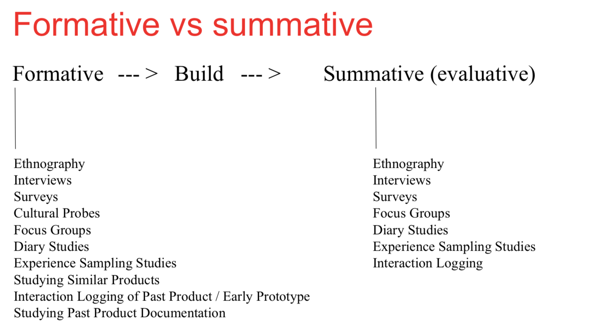
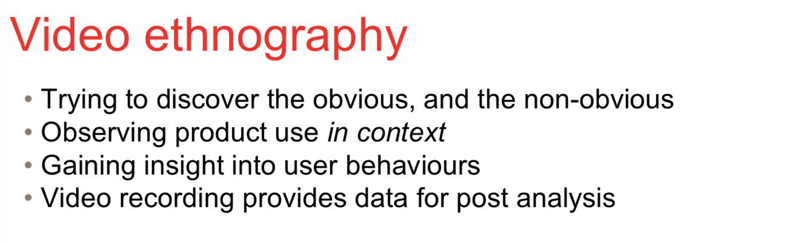
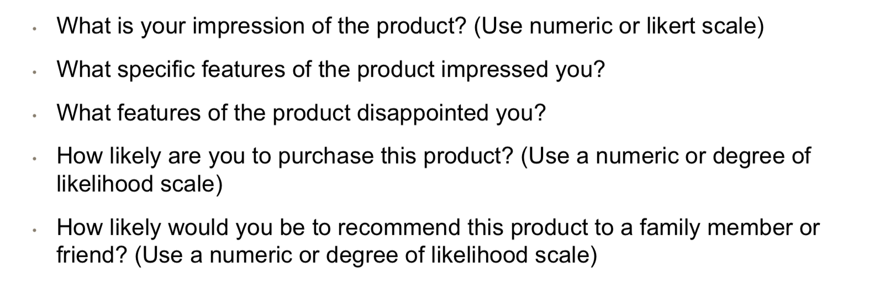

# Getting feedback

## Feedback types

- (Paper) Prototypes
- Surveys
- Interviews
- Usability tests
- Focus groups
- Log analysis

## User research methods

### 3 dimensional framework

- Attitudinal vs. Behavioral
- Qualitative vs. Quantitative
- Context of use

## Formative usability testing vs Summative usability testing

### Formative

- Use at the start of the design
- Testing with paper-prototypes and similar
- To discover the design orientation.

### Summative usability testing

- More like a quality assurance testing
- User at latter half of the development phase.
- Testing with actual working prototypes
- Do this to determine metrics and then compare with the result of the improved version.
- There will be users to test the product before it released.

# Observations

- We can't ask users twhat they want, what they say is different than what they do.

  - => Watch what people do.

  > # How to stalk people
  >
  > 
  >
  > - Fly on the wall : Walk from far away
  > - A day in the life: trailing them to see what they do for the whole day
  > - Shadowing: like a day in the life but more active
  > - Personal Inventory: look at their inventory to see what group of people they're in.

## Ethnography (culture)

- Is observing people in a small scale. Like developing a car park, ethnographist will look at what people do, how people read the sign.
- Today ethnography is **applied to the study of people and social groups**.

## 3 principles of ethnography

- Holistic: tiny details into big picture context, attempt to look at thing broadly - understand the context
- Natural settings: observe in the things that you're trying to study
- Descriptive: focus on recording behavior.

- Record how people use the interface by recording video.

## Diary Study

- users are requested to record feedback and/or events on a specific part of a product experience.
- usually lasts a week or 2.

<u>Advantages</u>

- Rich data, covers responses over time.
- Context rich data, user experience may be related to external and internal aspects.

<u>Disadvantages</u>

- Resource intensive - time/$$
- Self reporting bias.
- Highly reliant on user participation.

## Focus Group

- Can do before summative and formative.
- Bring together 6-9 users to discuss issues and concerns about the features of an user interface.
- Example questions
- 

## Surveys

### Disadvantage: 4 survey errors.

- Types of questions
  - Open ended questions:
    - Ask and leave space for the user to write freeform answers
  - Closed ended questions:
    - provide the answer and ask the users to select one or more ( multiple choices )
- Start with screener:
  - Start by asking if they used the site/app on that specific platform. 
- Do not lead the user.
- Do not waste time.
- Dont make the user feel tested.