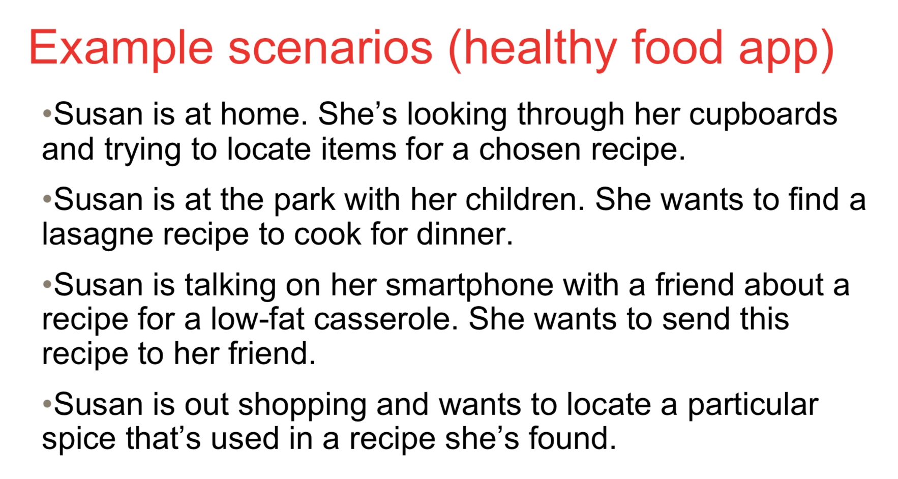

# Design Framework

## Design Framework

- Consists of

  - Interaction Framework
  - Visual Design Framework
  - Industrial Design Framework

## Scenarios

- To adapt and complement usere requirements from planning document
- Defining the interaction framework.
- Uses the persona as the main character
- Focuses on the story of the persona
- Keep details to a minimum

## Constructing Scenarios

- Create a story where persona is able to achieve his/her goals by using the system
- The story should have a beginning that provides the framework for the nerrative
- It must also have an ending where the goal is achieved

*However these scenarios doesn't have any endings.*

Personas is not a real person. Just to identify the type of user that gonna interact with the system.

You need to figrure out how many frame do you need for the prototype

## Form factor

What type of device are you designing for?

IOS, IPHONE 5S - 640x1136...

## Posture

How it feels to the user.

Casual, professional, transient looking app?

## Input methods

What means do user interacts with the application

- keyboard, mouse
- voice
- touch, swipe
- gestures...

## Functional elements

## Functional groups

- Consider:
  - Real estate requirements
  - Container elements
  - Proximity - 
    - given idea to the user that this belongs to certain functional groupping. 
    - Example: add button + calendar view has to be close together since they are the same function
  - Optimising flow
    - How do people got to a certain task
    - How to put it in a suitable layout.
  - Other design principle

# Rapid prototyping and mockups

## Fidelity

- Complete stage
- Low fidelity:
  - more like a sketch missing details
- High fidelity
  - similar to finished product

## Mental models

- Mental representation of how something works in the real world

