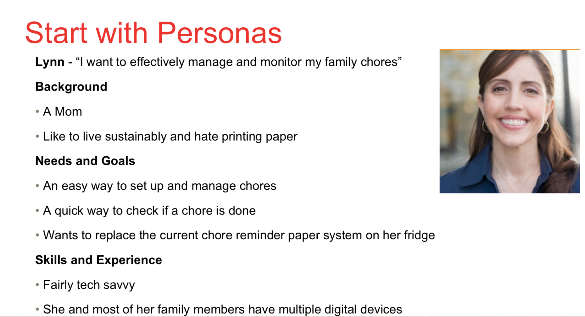
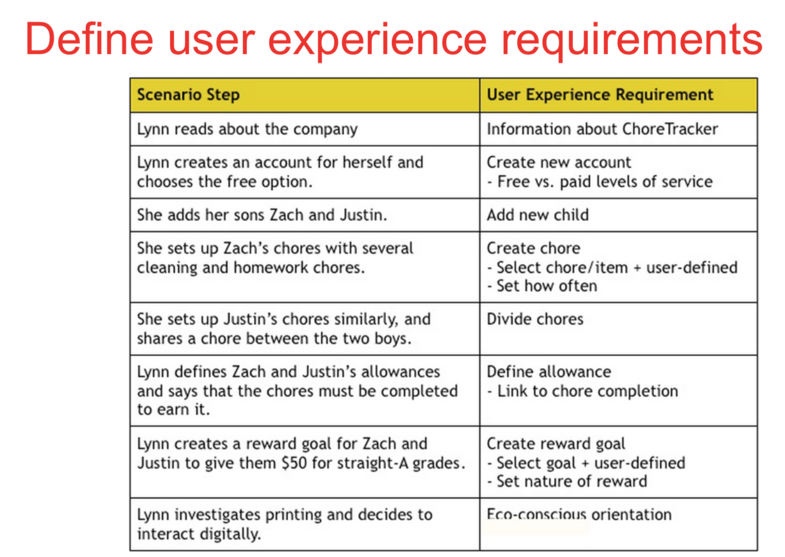
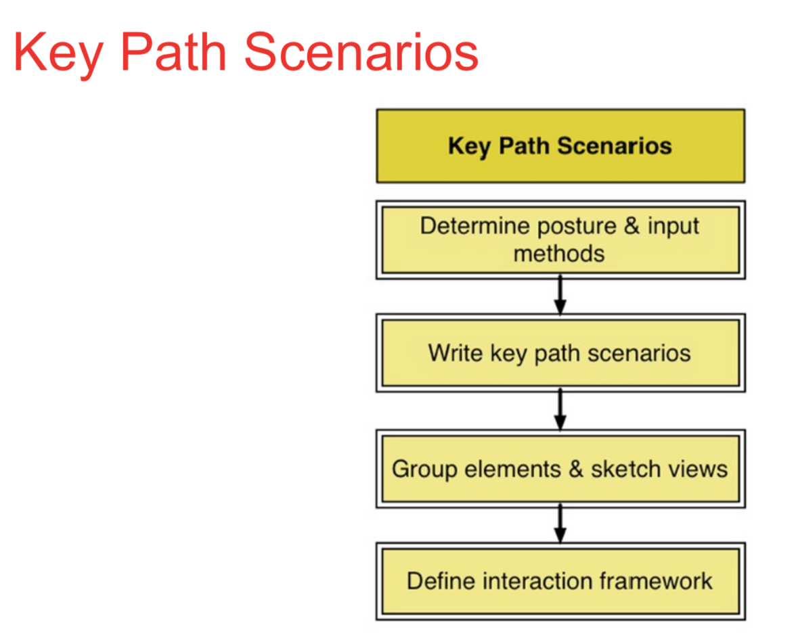
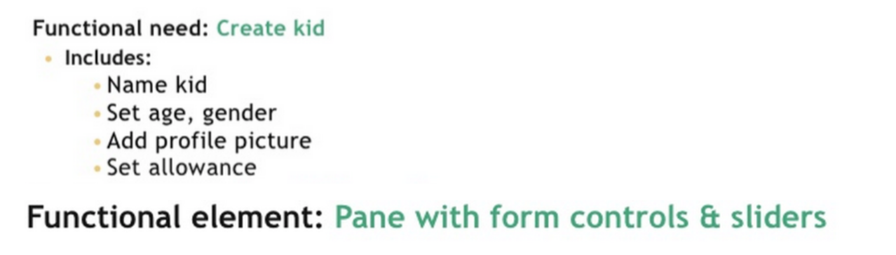
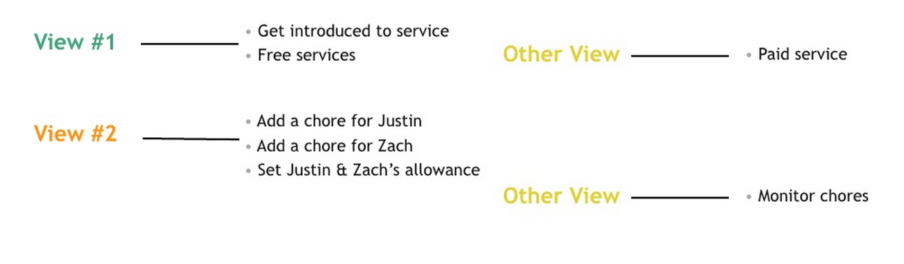
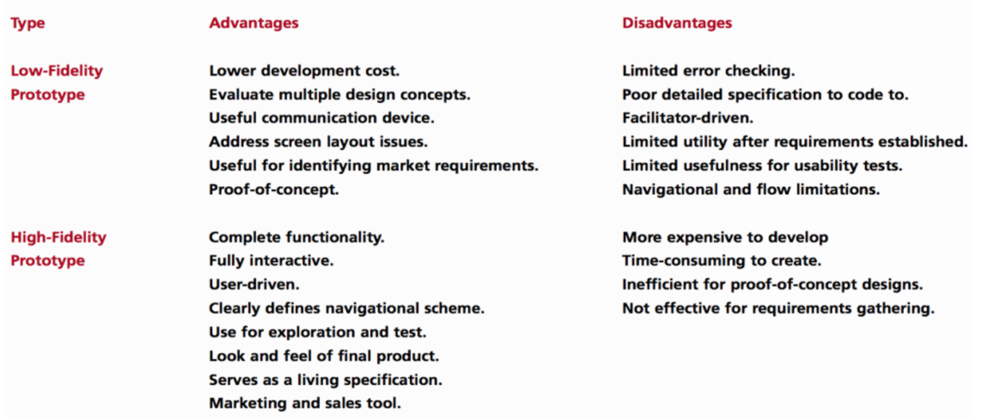

# Design Framework

## Design Framework

- Consists of

  - Interaction Framework
  - Visual Design Framework
  - Industrial Design Framework

## Scenarios

- To Adapt user's requirement
- To design it correctly.
- Uses the persona as the main character
- Focuses on the story of the persona
- Keep details to a minimum

## Constructing Scenarios

- Create a story where persona is able to achieve his/her goals by using the system
- The story should have a beginning that provides the framework for the nerrative
- It must also have an ending where the goal is achieved

*However these scenarios doesn't have any endings.*

- There are 4 types of scenarios : "context"  => "key path"  => "validation" => "communication"

Personas is not a real person. Just to identify the type of user that gonna interact with the system.

You need to figrure out how many frame do you need for the prototype

## Form factor

What type of device are you designing for?

IOS, IPHONE 5S - 640x1136...

## Posture

How it feels to the user.

Casual, professional, transient looking app?

## Input methods

What means do user interacts with the application

- keyboard, mouse
- voice
- touch, swipe
- gestures...

## Functional elements

## Functional groups

- Consider:
  - Real estate requirements
  - Container elements
  - Proximity - 
    - given idea to the user that this belongs to certain functional groupping. 
    - Example: add button + calendar view has to be close together since they are the same function
  - Optimising flow
    - How do people got to a certain task
    - How to put it in a suitable layout.
  - Other design principle

# Rapid prototyping and mockups

## Fidelity

- Complete stage
- Low fidelity:
  - more like a sketch missing details
- High fidelity
  - similar to finished product
- Look fidelity:
  - Prototype appearance
- Feel fidelity:
  - How user interact with prototype

## Vertical and Horizontal prototypes

Horizontal prototypes
- Focus on a varied of features

Vertical prototypes

- Explore a specific feature in detail.

## Paper Prototypes

Benefits
- Valuable testing tool.
- Put the designer in the role of user
- Shows present and missing functionality

Limitations
- Look and feel difficult to be evaluated.
- Response time cannot be simulated

# Work/Dataflow diagrams

## Document workflow models

- Creating diagrams and charts for your task.
- Many ways to do:
  - Mental Models
  - Mind mapping
  - Mapping user action flows.

### Mental models

- Mental representation of how something works in the real world
- E.g check out process on a shopping website.

### Mind map

- Like normal Mind map.

### Documenting workflow models

- Can be simple or as complex as required.
- Helps you visualize the task steps

## Information Architecture

## Card sorting

- Write the name of main items on an index card
- Shuffle the cards and give the deck to a user
- Ask each user to sort the cards into piles, placing items that belong together in the same pile ( they can make as many or as few piles as they want )
- Optional extra steps including asking users to arrange the resulting piles into bigger group and to name the different groups and piles.

> You need about 15-20 users to do this