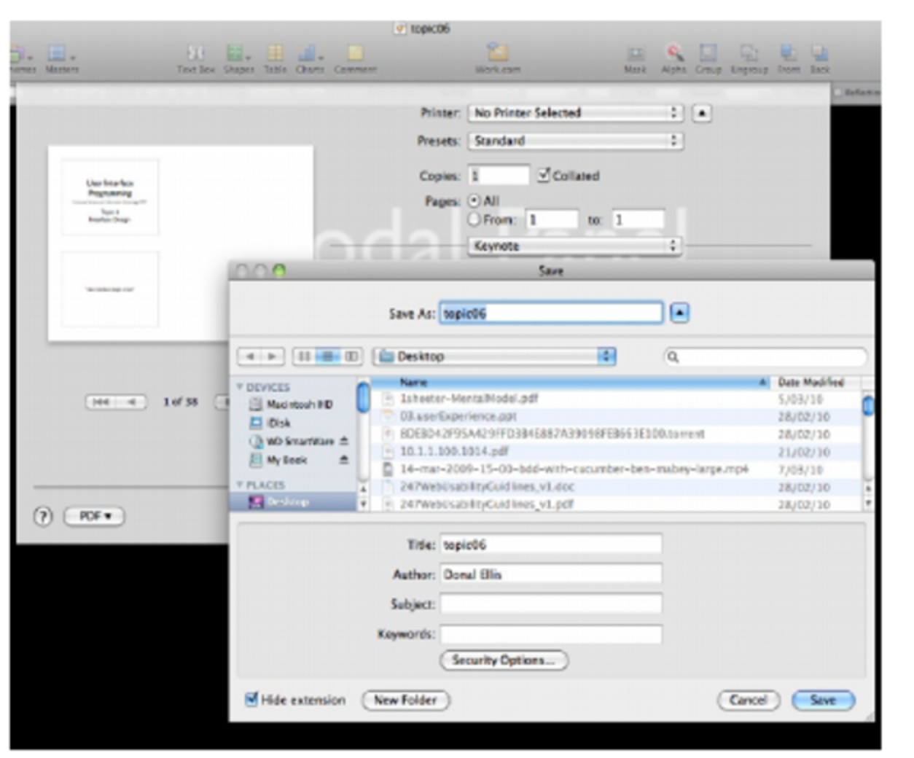

# Lecture 8: Interface Design

## Interface design

- Consists of interaction principles and patterns (proximity, ...)
- Another principle: ==Minimizing User's work==

### Minimizing user's work

- Organize your content properly
  - Card Sorting
  - Flow
    - [https://www.quora.com/How-would-one-use-Csikszentmihalyis-theory-of-Flow-to-evaluate-the-UX-of-a-product (Links to an external site.)Links to an external site.](https://www.quora.com/How-would-one-use-Csikszentmihalyis-theory-of-Flow-to-evaluate-the-UX-of-a-product)
## Patterns

  - Pre-built interface solutions to a wide range of common interface problems
    - Tested
    - Proven
    - Valuable
  - Don't re-invent the wheel
  - Page layout buttons
      - Titled sections
      - Card stack
      - Closable panels (collapsable element)
      - Moveable panels
      - Responsive disclosure && responsive enabling:
          - When you click on something, it shows details.

### Page layout

- Visual Hierarchy
  - The most important content should be most prominent
  - The least important content should be least prominent
- Visual flow
- Grouping and alignment

#### Visual Hierarchy

- Upper left corner
- Whitespace
- Contrasting fonts
- Contrasting foreground and background
- Spatial positioning
- Graphics

#### Visual Flow

- The movement of the users' eyes over the page
- Designed to make the users' eyes follow in the correct order.

#### Grouping and alignment

- Group related element together.
- Alignment - vertically or horizontally.

#### Page layout patterns

- Visual hierarchy patterns
  - Visual framework
  - Center stage

## Navigation patterns

- Global navigation

- hub and spoke

- pyramid

- modal panel

### Global navigation

- Use a small part of the interface to show a consistent link or buttons on each screen.
- Work out a sensible organisational structure
- Give sections short and meaningful name
- Should be consistent.

### Hub and Spoke

- User will return to the main menu when finished visiting a link or using an application

### Pyramid

- Link pages together with next and previous link.

- Child page will have a link to parrent page.

## Model panel

- popup a pannel.

